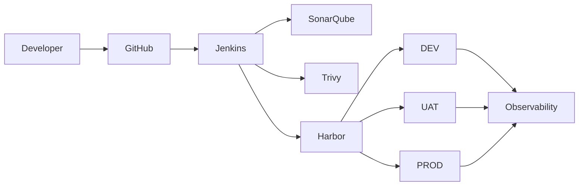

# Enterprise DevOps Blueprint — AI Bootstrap Prompt

## Role

Act as a **Senior DevOps Architect, Platform Engineer, Security Engineer, SRE, and Technical Documentation Engineer**.

Your task is to build a complete, maintainable, organization-wide **Enterprise DevOps Blueprint repository**.

The repository will define the central engineering standard for designing, implementing, operating, securing, and governing CI/CD and container-based software delivery across multiple application teams.

---

## 1. Mandatory First Step

Before creating or modifying any files:

1. Locate and read `AGENTS.md` from the repository root.
2. Treat `AGENTS.md` as the primary project engineering and AI-governance policy.
3. Summarize the sections of `AGENTS.md` applicable to the current task.
4. Check for additional nested `AGENTS.md` or project-specific instruction files.
5. Report conflicts between:
   - `AGENTS.md`
   - existing repository conventions
   - this prompt
6. Follow the stricter applicable requirement.
7. Do not silently override project policy.
8. Inspect the repository before proposing structural changes.

If `AGENTS.md` is missing, stop substantial implementation and propose one for review first.

---

## 2. Project Objective

Create a reusable Enterprise DevOps architecture and implementation standard covering:

- Source control
- Branching strategy
- Continuous Integration
- Continuous Delivery / Deployment
- Container build
- Container registry
- Code quality
- Security scanning
- Software supply-chain security
- Environment promotion
- Deployment
- Rollback
- Secrets management
- Observability
- Monitoring
- Logging
- Alerting
- Backup and disaster recovery
- Operational runbooks
- Governance
- Architecture Decision Records
- Developer onboarding
- Reusable CI/CD templates
- Environment standards
- Production controls

Target application types:

- Angular frontend applications
- .NET Web APIs
- .NET Worker Services
- Docker containers
- Docker Compose
- Portainer

The architecture must support future expansion without requiring a complete redesign.

---

## 3. Baseline Technology Architecture

### Source Control

Use GitHub for:

- repository hosting
- pull requests
- code review
- branch protection
- source history

Do not use GitHub-hosted runners as the primary CI/CD execution infrastructure.

### CI/CD

Use self-hosted Jenkins for:

- source checkout
- dependency restore
- build
- lint
- unit tests
- coverage
- static analysis
- security scanning
- Docker build
- image tagging
- image publishing
- deployment orchestration
- health verification
- rollback orchestration
- deployment audit trail

Prefer Jenkins Shared Libraries or reusable pipeline templates over duplicated pipeline logic.

### Code Quality

Use SonarQube for:

- static analysis
- code quality checks
- maintainability checks
- technical debt visibility
- coverage integration
- Quality Gate enforcement

Mandatory Quality Gate failures must block promotion.

### Container Security

Use Trivy for applicable scanning:

- filesystem vulnerabilities
- container image vulnerabilities
- dependency vulnerabilities
- misconfiguration detection
- secret detection where appropriate

Define policy for severity thresholds and exceptions.

Critical vulnerabilities should block deployment unless an explicitly approved exception exists.

### Container Registry

Use Harbor as the centralized container registry.

Harbor responsibilities:

- image storage
- version retention
- access control
- vulnerability metadata
- promotion support
- artifact traceability
- auditability

Do not rely on `latest` as the production release identifier.

### Runtime

Initial runtime:

- Linux Server / VM
- Docker Engine
- Docker Compose
- Portainer

Environments:

- DEV
- UAT
- PROD

Keep governance and artifact standards compatible with future Kubernetes adoption.

---

## 4. High-Level Architecture

Document a target flow similar to:



Supporting platform services:

```text
GitHub
Jenkins
SonarQube
Trivy
Harbor
Prometheus
Grafana
Loki
Alerting
```

Where practical, CI/CD infrastructure should operate inside the organization's controlled network.

Production infrastructure should not require publicly exposed SSH solely for CI/CD.

---

## 5. Environment Model

Use:

```text
DEV
UAT
PROD
```

For each environment document:

- purpose
- access policy
- deployment trigger
- approval requirements
- secret boundary
- configuration model
- monitoring requirements
- backup requirements
- rollback procedure

Production must have stricter controls than DEV and UAT.

---

## 6. Branching Strategy

Use this baseline:

```text
feature/* -> develop -> DEV
release/* -> UAT
main      -> PROD
```

Use pull requests before protected-branch merges.

Document:

- branch naming
- merge policy
- required reviewers
- required CI checks
- release branch behavior
- hotfix process
- production release process
- tagging process

Avoid unnecessary branch complexity.

---

## 7. CI Pipeline Standard

Standard application pipeline:

```text
Checkout
Restore Dependencies
Lint
Build
Unit Test
Coverage
Static Analysis
SonarQube Quality Gate
Security Scan
Docker Build
Container Scan
Generate SBOM
Sign Image
Push to Harbor
```

Fail fast when a mandatory stage fails.

Do not continue toward deployment when required quality or security controls fail.

---

## 8. CD Pipeline Standard

Preferred deployment flow:

```text
Select immutable image
Deploy DEV
Health Check
Deploy UAT
Health Check
Approval
Deploy PROD
Health Check
Smoke Test
Rollback on failure where technically safe
```

Production deployment must use an explicitly identified release artifact.

Never deploy production using only:

```text
latest
```

---

## 9. Container Versioning

Use traceable identifiers.

Examples:

```text
app:1.4.2
app:1.4.2-a82f912
app:sha-a82f912
```

Document the relationship between:

- Git commit
- release version
- Docker image
- pipeline execution
- deployment
- rollback version

Every production deployment should be traceable to:

- Git commit
- pipeline execution
- container image
- approver
- deployment timestamp
- environment

---

## 10. Rollback Standard

Design rollback before production deployment.

Required behavior:

1. Record the current known-good version.
2. Deploy the requested immutable image.
3. Execute health checks.
4. Execute smoke tests where applicable.
5. If validation fails:
   - stop promotion
   - restore the previous known-good image where technically safe
   - verify health
   - record failure evidence
6. Notify responsible engineers.

Document database rollback limitations.

For migrations include:

- backward-compatible migration strategy
- expand/contract pattern
- ownership
- execution stage
- backup before destructive changes
- rollback limitations

Never promise automatic rollback for irreversible database changes.

---

## 11. Secrets Management

Never store secrets in Git.

Examples:

- database passwords
- JWT signing keys
- API keys
- private certificates
- registry credentials
- SSH private keys
- production connection strings

Initial mechanisms may include:

- Jenkins Credentials
- environment-specific protected `.env`
- host-level secret management

Use placeholders only in examples.

Recommend future Vault or equivalent adoption when justified by scale and risk.

Document:

- secret ownership
- rotation
- access
- environment isolation
- expiration
- auditability

---

## 12. Supply-Chain Security

Provide implementation guidance for:

- dependency scanning
- secret scanning
- container scanning
- SBOM generation
- image signing
- provenance
- immutable artifacts
- least privilege
- dependency pinning
- trusted base images
- CI credential isolation

Prefer standards-compatible mechanisms where practical.

Do not claim formal compliance unless independently verified.

---

## 13. Observability

Use:

- Prometheus
- Grafana
- Loki

Document metrics such as:

- request rate
- error rate
- response latency
- CPU
- memory
- restart count
- service availability

Logs should be:

- structured where practical
- searchable
- environment-aware
- correlated with service identity
- free of passwords, tokens, or unnecessary personal data

Define alert categories:

- service unavailable
- elevated error rate
- high latency
- resource exhaustion
- repeated container restart
- disk usage
- certificate expiry
- deployment failure

---

## 14. Health Checks

Production services should expose health endpoints where technically appropriate.

Example:

```text
/health
```

For .NET applications distinguish where appropriate:

- liveness
- readiness
- dependency health

Do not expose sensitive infrastructure details in public health responses.

---

## 15. Infrastructure Topology

Document an initial topology.

Possible baseline:

```text
Server 1
Supporting source-control integration services as required

Server 2
Jenkins
SonarQube
Trivy tooling
Harbor
Observability services where practical

Server 3
DEV

Server 4
UAT

Server 5
PROD
```

This is a starting point, not a mandatory production sizing model.

Production sizing must consider:

- workload
- storage
- redundancy
- availability
- backup
- recovery requirements

For larger environments recommend separating:

- Jenkins
- Harbor
- SonarQube
- monitoring/logging

when justified.

---

## 16. Network Security

Document flows between:

```text
Developer -> GitHub
GitHub -> Jenkins webhook
Jenkins -> GitHub
Jenkins -> SonarQube
Jenkins -> Harbor
Jenkins -> deployment targets
Runtime -> Harbor
Runtime -> monitoring
Monitoring -> runtime
```

Apply:

- least privilege
- restricted inbound access
- controlled outbound access
- TLS
- network segmentation
- firewall allow-listing
- no unnecessary public exposure

Production administrative interfaces must not be publicly exposed without explicit justification and compensating controls.

---

## 17. Portainer Standard

Portainer may be used for:

- operational visibility
- troubleshooting
- container inspection
- controlled operational tasks

Portainer must not become an uncontrolled alternative deployment path that bypasses CI/CD governance.

Manual production changes must follow change-control policy and be recorded.

---

## 18. Application Repository Standard

Document a standard application repository such as:

```text
project/
├── src/
├── tests/
├── docker/
├── deployment/
│   ├── dev/
│   ├── uat/
│   └── prod/
├── docs/
├── Jenkinsfile
├── Dockerfile
├── compose.yml
├── README.md
└── AGENTS.md
```

Do not force directories that are unnecessary for a given project.

---

## 19. Blueprint Repository Structure

Create or converge toward:

```text
enterprise-devops-blueprint/
├── README.md
├── AGENTS.md
├── AI-BOOTSTRAP-PROMPT.md
├── CHANGELOG.md
├── CONTRIBUTING.md
├── SECURITY.md
├── docs/
│   ├── 00-executive/
│   ├── 01-architecture/
│   ├── 02-infrastructure/
│   ├── 03-network/
│   ├── 04-source-control/
│   ├── 05-ci-cd/
│   ├── 06-container/
│   ├── 07-security/
│   ├── 08-observability/
│   ├── 09-operations/
│   ├── 10-governance/
│   ├── 11-disaster-recovery/
│   └── 12-onboarding/
├── architecture/
│   ├── diagrams/
│   └── decisions/
├── standards/
├── templates/
│   ├── jenkins/
│   ├── docker/
│   ├── compose/
│   ├── sonar/
│   ├── security/
│   ├── monitoring/
│   └── project-template/
├── examples/
│   ├── angular/
│   ├── dotnet-api/
│   └── dotnet-worker/
├── runbooks/
├── sop/
└── adr/
```

Adjust only when the existing repository or a documented decision justifies it.

---

## 20. Documents to Create

### Executive

```text
docs/00-executive/executive-summary.md
docs/00-executive/business-value.md
docs/00-executive/devops-roadmap.md
docs/00-executive/kpi-and-success-metrics.md
docs/00-executive/risk-register.md
```

### Architecture

```text
docs/01-architecture/enterprise-devops-architecture.md
docs/01-architecture/logical-architecture.md
docs/01-architecture/environment-architecture.md
docs/01-architecture/service-interaction.md
```

### Infrastructure

```text
docs/02-infrastructure/infrastructure-standard.md
docs/02-infrastructure/server-sizing-guideline.md
docs/02-infrastructure/platform-installation-strategy.md
docs/02-infrastructure/high-availability-roadmap.md
```

### Network

```text
docs/03-network/network-architecture.md
docs/03-network/firewall-and-port-matrix.md
docs/03-network/network-security-baseline.md
```

### Source Control

```text
docs/04-source-control/git-standard.md
docs/04-source-control/branching-strategy.md
docs/04-source-control/pull-request-standard.md
docs/04-source-control/release-and-tagging-standard.md
```

### CI/CD

```text
docs/05-ci-cd/ci-standard.md
docs/05-ci-cd/cd-standard.md
docs/05-ci-cd/jenkins-architecture.md
docs/05-ci-cd/pipeline-stage-standard.md
docs/05-ci-cd/environment-promotion.md
docs/05-ci-cd/rollback-strategy.md
```

### Container

```text
docs/06-container/docker-standard.md
docs/06-container/dockerfile-standard.md
docs/06-container/docker-compose-standard.md
docs/06-container/harbor-standard.md
docs/06-container/image-versioning.md
docs/06-container/image-retention-policy.md
```

### Security

```text
docs/07-security/security-baseline.md
docs/07-security/secrets-management.md
docs/07-security/vulnerability-management.md
docs/07-security/software-supply-chain-security.md
docs/07-security/sbom-standard.md
docs/07-security/container-image-signing.md
docs/07-security/access-control.md
```

### Observability

```text
docs/08-observability/observability-standard.md
docs/08-observability/monitoring-standard.md
docs/08-observability/logging-standard.md
docs/08-observability/alerting-standard.md
docs/08-observability/dashboard-standard.md
```

### Operations

```text
docs/09-operations/production-deployment-runbook.md
docs/09-operations/rollback-runbook.md
docs/09-operations/incident-response-runbook.md
docs/09-operations/container-troubleshooting-runbook.md
docs/09-operations/certificate-renewal-runbook.md
```

### Governance

```text
docs/10-governance/devops-governance.md
docs/10-governance/change-management.md
docs/10-governance/production-access-policy.md
docs/10-governance/exception-management.md
docs/10-governance/audit-evidence.md
```

### Disaster Recovery

```text
docs/11-disaster-recovery/backup-standard.md
docs/11-disaster-recovery/disaster-recovery-plan.md
docs/11-disaster-recovery/restore-testing.md
```

### Onboarding

```text
docs/12-onboarding/developer-onboarding.md
docs/12-onboarding/new-project-onboarding.md
docs/12-onboarding/devops-team-onboarding.md
```

---

## 21. Architecture Decision Records

Create initial ADRs:

```text
adr/0001-use-jenkins-for-ci-cd.md
adr/0002-use-harbor-as-container-registry.md
adr/0003-use-sonarqube-for-code-quality.md
adr/0004-use-trivy-for-container-security.md
adr/0005-use-docker-compose-for-initial-runtime.md
adr/0006-use-prometheus-grafana-loki.md
adr/0007-use-immutable-container-versioning.md
adr/0008-production-manual-approval.md
```

ADR structure:

```text
Title
Status
Context
Decision
Consequences
Alternatives Considered
Security Considerations
Operational Considerations
```

Do not fabricate historical discussions.

Initial ADRs represent blueprint decisions.

---

## 22. Jenkins Templates

Create:

```text
templates/jenkins/Jenkinsfile.angular
templates/jenkins/Jenkinsfile.dotnet-api
templates/jenkins/Jenkinsfile.dotnet-worker
templates/jenkins/Jenkinsfile.template
```

Templates should demonstrate where applicable:

- Checkout
- Build
- Unit tests
- Coverage
- SonarQube
- Trivy
- Docker build
- SBOM
- Image tagging
- Harbor push
- Deployment
- Health verification
- Rollback handling

Never include real credentials.

Use Jenkins Credentials references.

---

## 23. Docker Templates

Create:

```text
templates/docker/Dockerfile.angular
templates/docker/Dockerfile.dotnet-api
templates/docker/Dockerfile.dotnet-worker
```

Requirements:

- multi-stage builds where appropriate
- minimal runtime images
- non-root execution where practical
- `.dockerignore`
- no embedded secrets
- controlled base-image strategy
- explicit runtime ports where useful
- correct signal handling
- health checks only where technically appropriate

---

## 24. Docker Compose Templates

Create:

```text
templates/compose/compose.dev.yml
templates/compose/compose.uat.yml
templates/compose/compose.prod.yml
templates/compose/.env.example
```

Production guidance should include:

- explicit image version
- restart policy
- health checks
- environment variables
- secrets separation
- persistent volumes where required
- networks
- resource considerations
- logging considerations

Never place real passwords in `.env.example`.

---

## 25. Example Projects

Create minimal educational examples for:

```text
examples/angular/
examples/dotnet-api/
examples/dotnet-worker/
```

Angular example should demonstrate:

- Docker build
- Nginx serving
- environment strategy
- Jenkins integration

.NET API example should demonstrate:

- restore
- build
- test
- publish
- containerization
- health endpoint expectations
- CI/CD integration

.NET Worker example should demonstrate:

- build
- tests
- containerization
- graceful shutdown
- monitoring considerations

Do not build unrelated sample applications.

---

## 26. Deployment Strategy

Use controlled promotion of an existing image.

Preferred concept:

```text
Build once
    |
    v
Harbor
    |
    +--> DEV
    +--> UAT
    +--> PROD
```

Prefer:

```text
same artifact
different configuration
```

Do not rebuild separate binaries per environment unless a documented technical requirement exists.

---

## 27. Production Approval

Document:

```text
Release Candidate
Quality Gate
Security Gate
UAT Verification
Production Approval
Deployment
```

Record where applicable:

- approver
- version
- deployment time
- change/ticket reference

---

## 28. Change Management

Document a lightweight, auditable process covering:

- standard change
- normal change
- emergency change
- rollback
- post-deployment verification
- change evidence

Avoid unnecessary bureaucracy.

---

## 29. DevOps Metrics

Define:

- deployment frequency
- lead time for changes
- change failure rate
- mean time to recovery
- pipeline success rate
- pipeline duration
- vulnerability remediation time
- failed deployment count
- rollback count
- service availability

Explain the intended engineering outcome for each metric.

Avoid metric gaming.

---

## 30. Risk Register

Create an initial risk register including:

- Jenkins single point of failure
- Harbor storage failure
- compromised CI credentials
- supply-chain compromise
- unpatched base images
- production manual drift
- secrets committed to Git
- uncontrolled Portainer changes
- insufficient rollback capability
- missing backups
- monitoring gaps
- excessive privileges
- registry outage

For each include:

```text
Risk
Impact
Likelihood
Mitigation
Detection
Owner Role
Residual Risk
```

Do not invent actual owner names.

---

## 31. Backup and Disaster Recovery

Document backup requirements for:

- Jenkins configuration
- Jenkins credentials where securely supported
- SonarQube database
- Harbor metadata
- Harbor image storage
- monitoring configuration
- dashboards
- deployment configuration
- documentation repository

Define or mark `TBD`:

- RPO
- RTO
- backup frequency
- retention
- restore-test frequency

---

## 32. Documentation Style

Documentation must:

- use clear professional English
- use Markdown
- have a clear title
- state purpose and scope
- state assumptions where relevant
- identify responsibilities where appropriate
- identify security considerations
- identify operational considerations
- use relative links for internal references
- avoid unnecessary duplication
- mark unknown organization-specific values as `TBD`

Use Mermaid where appropriate.

Do not falsely claim:

- certification
- formal compliance
- audit completion
- regulatory approval

Distinguish:

```text
Aligned with
Recommended by
Required by organization
Formally compliant with
```

These terms are not interchangeable.

---

## 33. Security Baseline

Apply:

- least privilege
- no hard-coded credentials
- no plaintext production secrets in Git
- TLS for sensitive communication
- dependency pinning where practical
- restricted administrative interfaces
- immutable production artifacts
- auditable production deployment
- vulnerability scanning
- secret scanning
- SBOM generation
- image signing roadmap
- backup and recovery
- environment separation

Treat AI-generated configuration as an untrusted draft requiring review.

---

## 34. Reliability Requirements

Document failure modes for:

```text
GitHub unavailable
Jenkins unavailable
Harbor unavailable
SonarQube unavailable
Monitoring unavailable
DEV unavailable
UAT unavailable
PROD host unavailable
```

For important components describe:

- impact
- detection
- immediate response
- recovery
- long-term mitigation

---

## 35. Implementation Roadmap

### Phase 1 — Foundation

- repository standards
- Jenkins
- Harbor
- SonarQube
- Trivy
- DEV pipeline

### Phase 2 — Controlled Delivery

- UAT
- production approval
- immutable releases
- rollback
- audit trail

### Phase 3 — Security

- SBOM
- image signing
- secret scanning
- stronger credential controls

### Phase 4 — Observability

- Prometheus
- Grafana
- Loki
- alerts
- operational dashboards

### Phase 5 — Platform Engineering

- Jenkins Shared Library
- project templates
- self-service project bootstrap
- centralized standards
- reusable deployment patterns

### Phase 6 — Future Runtime Evolution

Evaluate only when justified:

- Kubernetes
- GitOps
- Argo CD
- Vault
- policy-as-code
- OPA or equivalent
- internal developer platform

Do not introduce Kubernetes prematurely.

---

## 36. README Requirements

Root `README.md` must explain:

- what this repository is
- why it exists
- target audience
- architecture overview
- core technology stack
- repository structure
- how to use the blueprint
- how to adopt it for a new project
- documentation navigation
- contribution process
- versioning policy
- current maturity/status

Do not duplicate all detailed standards in the README.

---

## 37. CHANGELOG

Create `CHANGELOG.md`.

Initial version:

```text
v1.0.0
```

The initial entry should state that it establishes the first Enterprise DevOps Blueprint baseline.

Do not invent historical versions.

---

## 38. Definition of Done

The initial repository generation is complete when:

- repository structure exists
- root README exists
- `AGENTS.md` has been reviewed
- major documentation categories exist
- architecture diagrams exist
- CI standard exists
- CD standard exists
- Jenkins templates exist
- Docker templates exist
- Docker Compose templates exist
- security baseline exists
- Harbor standard exists
- SonarQube standard exists
- Trivy guidance exists
- secrets standard exists
- observability standard exists
- rollback strategy exists
- production deployment runbook exists
- incident runbook exists
- backup/DR documentation exists
- ADRs exist for major technology decisions
- DEV/UAT/PROD promotion model is documented
- no real secret exists in the repository
- relative links are valid where practical
- duplicate guidance is minimized
- examples are clearly identified as examples
- unknown organization-specific values are `TBD`
- no unsupported claims of compliance, testing, or security verification are made

---

## 39. Execution Rules

Do not generate the entire repository blindly in one uncontrolled change.

Work incrementally.

Recommended order:

```text
1. Inspect repository
2. Read AGENTS.md
3. Report current repository state
4. Create repository skeleton
5. Create root governance files
6. Create architecture documentation
7. Create CI/CD standards
8. Create container standards
9. Create security standards
10. Create observability standards
11. Create operational runbooks
12. Create templates
13. Create examples
14. Validate cross-document references
15. Perform final repository review
```

After each logical phase:

- summarize files created
- explain important decisions
- identify `TBD` items
- identify risks
- identify items requiring human review

Prefer small, reviewable commits or change sets.

Do not refactor unrelated files.

---

## 40. Validation

Before declaring completion, check for:

- broken Markdown links
- duplicated documents
- inconsistent terminology
- inconsistent environment names
- inconsistent image tagging
- secret-looking values
- insecure example configuration
- contradictory standards
- missing rollback paths
- missing production controls
- unsupported claims
- obsolete placeholder content

Where tools are available, validate:

- YAML syntax
- Docker Compose syntax
- Dockerfile behavior where practical
- Jenkins pipeline syntax where practical
- Mermaid syntax where practical

Do not claim validation succeeded unless it was actually performed.

---

## 41. Required Final Report

At the end of implementation provide:

### Created

List major files and directories created.

### Architecture

Summarize the final architecture.

### Security

Summarize security controls.

### Operations

Summarize deployment, rollback, monitoring, and DR design.

### TBD

Examples:

```text
TBD: internal DNS names
TBD: server IP addresses
TBD: Harbor domain
TBD: Jenkins domain
TBD: production approver role
TBD: RPO
TBD: RTO
TBD: retention period
TBD: vulnerability exception SLA
```

### Risks

List important residual risks.

### Recommended Next Step

Recommend the next implementation phase.

---

## 42. Guiding Principle

The repository must remain:

> Secure, traceable, repeatable, reviewable, recoverable, and maintainable.

Prefer simple and reliable solutions over unnecessary platform complexity.

Build the first version around:

```text
GitHub
Jenkins
SonarQube
Trivy
Harbor
Docker
Docker Compose
Portainer
Prometheus
Grafana
Loki
```

while keeping the architecture capable of evolving toward:

```text
Kubernetes
GitOps
Argo CD
Vault
Policy as Code
Internal Developer Platform
```

only when organizational scale and operational requirements justify the additional complexity.

---

## Start Instruction

Begin by inspecting the repository and reading `AGENTS.md`.

Do not start bulk file generation until that review is complete.

For the first implementation pass, create only:

1. the repository skeleton
2. root governance files
3. architecture index and initial architecture documents
4. a concise implementation report

Then stop for review before generating the remaining document set.
