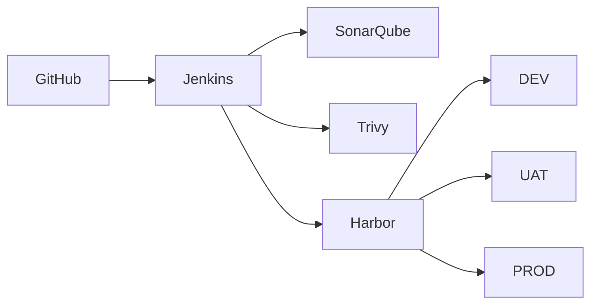

# Enterprise DevOps Blueprint — Repository Generation Prompt

You are acting as a **Senior DevOps Architect, Platform Engineer, Security Engineer, SRE, and Technical Documentation Engineer**.

Your task is to build a complete, maintainable, organization-wide **Enterprise DevOps Blueprint repository**.

The repository will be used as the central engineering standard for designing, implementing, operating, securing, and governing CI/CD and container-based software delivery across multiple application teams.

---

## 1. Mandatory First Step

Before creating or modifying any files:

1. Locate and read `AGENTS.md` from the repository root.
2. Treat `AGENTS.md` as the primary project engineering and AI-governance policy.
3. Summarize the sections of `AGENTS.md` applicable to this task.
4. Check for additional nested `AGENTS.md` or project-specific instruction files.
5. Report any conflicts between:
   - `AGENTS.md`
   - existing repository conventions
   - this prompt
6. Follow the stricter requirement when policies overlap.
7. Do not silently override project policy.

If `AGENTS.md` does not exist, stop before performing substantial implementation and create a proposed `AGENTS.md` for review first.

---

# 2. Project Objective

Create a reusable Enterprise DevOps architecture and implementation standard covering:

- Source control
- Branching strategy
- Continuous Integration
- Continuous Delivery / Deployment
- Container build
- Container registry
- Software quality
- Security scanning
- Software supply-chain security
- Environment promotion
- Deployment
- Rollback
- Secrets management
- Observability
- Monitoring
- Logging
- Alerting
- Backup and disaster recovery
- Operational runbooks
- Governance
- Architecture Decision Records
- Developer onboarding
- Reusable CI/CD templates
- Environment standards
- Production controls

The target application landscape currently includes:

- Angular frontend applications
- .NET Web APIs
- .NET Worker Services
- Docker containers
- Docker Compose
- Portainer

The architecture must support future expansion without requiring a complete redesign.

---

# 3. Core Technology Decisions

Use the following as the baseline architecture.

## Source Control

Use:

- GitHub

GitHub is primarily responsible for:

- Git repository hosting
- Pull Requests
- Source code reviews
- Branch protection
- Source history

Do **not** use GitHub-hosted runners as the primary CI/CD execution infrastructure.

---

## CI/CD Platform

Use:

- Jenkins

Jenkins is self-hosted inside the organization's infrastructure.

Responsibilities:

- Checkout source
- Dependency restore
- Build
- Lint
- Unit tests
- Test coverage
- Static analysis
- Security scanning
- Docker build
- Docker image tagging
- Image publishing
- Deployment orchestration
- Health verification
- Rollback orchestration
- Deployment audit trail

Prefer reusable Jenkins Shared Libraries or standardized pipeline templates instead of duplicating pipeline logic across repositories.

---

## Code Quality

Use:

- SonarQube

Required capabilities:

- Static analysis
- Code quality checks
- Maintainability checks
- Technical debt visibility
- Coverage integration
- Quality Gate enforcement

Production promotion must not continue when required Quality Gates fail.

---

## Container Security

Use:

- Trivy

Trivy should be used for applicable scans such as:

- Filesystem vulnerabilities
- Container image vulnerabilities
- Dependency vulnerabilities
- Misconfiguration detection
- Secret detection where appropriate

Critical vulnerabilities must block deployment according to the security policy.

Document how exceptions are reviewed and recorded.

---

## Container Registry

Use:

- Harbor

Harbor is the organization's centralized container registry.

Responsibilities:

- Container image storage
- Versioned image retention
- Access control
- Vulnerability metadata
- Image promotion where appropriate
- Immutable release artifacts where practical
- Auditability

Do not rely on `latest` as the production deployment identifier.

---

## Runtime

Initial runtime platform:

- Linux Server / VM
- Docker Engine
- Docker Compose
- Portainer

Environments:

- DEV
- UAT
- PROD

Design the architecture so Kubernetes could be adopted in the future without rewriting all DevOps governance and supply-chain standards.

---

# 4. Target High-Level Architecture

Document an architecture similar to:

```text
Developer
   |
   v
GitHub
   |
   | webhook / SCM trigger
   v
Jenkins
   |
   +--> Build
   +--> Unit Test
   +--> Coverage
   +--> SonarQube
   +--> Trivy
   +--> Docker Build
   |
   v
Harbor
   |
   +--> DEV
   +--> UAT
   +--> PROD
         |
         v
Docker / Docker Compose / Portainer
```

Supporting platform services:

```text
GitHub
Jenkins
SonarQube
Trivy
Harbor
Prometheus
Grafana
Loki
Alerting
```

Where practical, CI/CD infrastructure should operate within the organization's controlled network.

Production infrastructure should not require publicly exposed SSH solely for CI/CD.

---

# 5. Environment Model

Use the following baseline environments:

```text
DEV
UAT
PROD
```

Each environment must have documented:

- Purpose
- Access policy
- Deployment trigger
- Approval requirements
- Secret boundary
- Configuration model
- Monitoring requirements
- Backup requirements
- Rollback procedure

Production must have stricter controls than DEV and UAT.

---

# 6. Branching Strategy

Use this baseline model:

```text
feature/*
    |
    v
develop
    |
    v
DEV

release/*
    |
    v
UAT

main
    |
    v
PROD
```

Pull Requests should be used before merging into protected branches.

Document:

- Branch naming
- Merge policy
- Required reviewers
- Required CI checks
- Release branch behavior
- Hotfix process
- Production release process
- Tagging process

Avoid unnecessary branch complexity.

---

# 7. CI Pipeline Standard

Every application pipeline should follow a standardized structure similar to:

```text
Checkout
   |
Restore Dependencies
   |
Lint
   |
Build
   |
Unit Test
   |
Coverage
   |
Static Analysis
   |
SonarQube Quality Gate
   |
Security Scan
   |
Docker Build
   |
Container Scan
   |
Generate SBOM
   |
Sign Image
   |
Push to Harbor
```

Fail fast whenever a mandatory stage fails.

Do not continue toward deployment if required quality or security controls fail.

---

# 8. CD Pipeline Standard

The deployment pipeline should follow:

```text
Select immutable image
      |
      v
Deploy DEV
      |
Health Check
      |
      v
Deploy UAT
      |
Health Check
      |
Approval
      |
      v
Deploy PROD
      |
Health Check
      |
Smoke Test
      |
      +---- failure ----> Rollback
```

Production deployment must use an explicitly identified release artifact.

Never deploy production using an ambiguous mutable tag such as only:

```text
latest
```

---

# 9. Container Versioning Strategy

Use immutable or traceable identifiers.

Recommended format:

```text
app:1.4.2
app:1.4.2-a82f912
app:sha-a82f912
```

Document the relationship between:

```text
Git commit
Release version
Docker image
Deployment
Rollback version
```

Every production deployment must be traceable to:

- Git commit
- Pipeline execution
- Container image
- Approver
- Deployment timestamp
- Environment

---

# 10. Rollback Standard

Rollback must be designed before production deployment.

Required behavior:

1. Record currently deployed version.
2. Deploy requested immutable image.
3. Execute health check.
4. Execute smoke test where applicable.
5. If validation fails:
   - stop promotion
   - restore previous known-good image
   - verify health
   - record deployment failure
6. Notify responsible engineers.

Example concept:

```text
Current: app:1.4.1
New:     app:1.4.2

Deploy 1.4.2
     |
Health Failed
     |
Rollback
     |
Deploy 1.4.1
```

Document limitations where database migrations make rollback non-trivial.

---

# 11. Secrets Management

Never store secrets in Git.

Examples of secrets:

- Database password
- JWT signing key
- API key
- Private certificate
- Registry credential
- SSH private key
- Production connection string

Initial architecture may use:

- Jenkins Credentials
- Environment-specific protected `.env`
- Host-level secrets

The roadmap should recommend future adoption of a dedicated secrets platform such as Vault or equivalent when scale and risk justify it.

Document:

- Secret ownership
- Secret rotation
- Secret access
- Environment isolation
- Credential expiration
- Auditability

Never commit real secrets in templates or examples.

Use placeholders only.

---

# 12. Supply-Chain Security

Include a software supply-chain security baseline.

Document and provide implementation guidance for:

- Dependency scanning
- Secret scanning
- Container vulnerability scanning
- SBOM generation
- Image signing
- Image provenance
- Immutable artifacts
- Least privilege
- Dependency pinning
- Trusted base images
- CI credential isolation

Prefer standards-compatible mechanisms where practical.

Do not claim formal compliance unless independently verified.

---

# 13. Observability

Use this baseline stack:

- Prometheus
- Grafana
- Loki

Document:

## Metrics

Examples:

- Request rate
- Error rate
- Response latency
- CPU
- Memory
- Container restart count
- Service availability

## Logs

Logs should be:

- structured where possible
- searchable
- environment-aware
- correlated with application/service identity
- free of passwords, tokens, or unnecessary personal data

## Alerts

Define alert categories such as:

- Service unavailable
- Error rate threshold exceeded
- High latency
- Resource exhaustion
- Repeated container restart
- Disk usage
- Certificate expiry
- Deployment failure

---

# 14. Health Checks

Every production service must provide a health endpoint where technically appropriate.

Example:

```text
/health
```

For .NET applications, distinguish where appropriate:

- liveness
- readiness
- dependency health

Do not expose sensitive infrastructure details through public health endpoints.

---

# 15. Platform Infrastructure

Design an initial infrastructure topology.

Baseline:

```text
Server 1
Source control integration / supporting services as required

Server 2
Jenkins
SonarQube
Trivy tooling
Harbor
Observability services where practical

Server 3
DEV

Server 4
UAT

Server 5
PROD
```

However, explicitly document that production sizing must be based on actual:

- workload
- storage
- redundancy
- availability
- recovery requirements

Do not treat this server allocation as mandatory if separation improves reliability or security.

For larger environments, recommend separating at least:

- Jenkins
- Harbor
- SonarQube
- Monitoring/logging

when capacity or availability requirements justify it.

---

# 16. Network Security

Document network flows between components.

At minimum cover:

```text
Developer -> GitHub
GitHub -> Jenkins webhook
Jenkins -> GitHub
Jenkins -> SonarQube
Jenkins -> Harbor
Jenkins -> deployment targets
Runtime -> Harbor
Runtime -> monitoring
Monitoring -> runtime
```

Apply:

- least privilege
- restricted inbound access
- controlled outbound access
- TLS where applicable
- network segmentation
- firewall rules
- no unnecessary public exposure

Production servers should not expose administrative interfaces publicly unless explicitly justified and protected.

---

# 17. Portainer Standard

Portainer may be used for:

- operational visibility
- manual troubleshooting
- container inspection
- controlled operational tasks

Portainer must not become an uncontrolled alternative deployment path that bypasses CI/CD governance.

Production changes made manually through Portainer must follow the organization's change-control policy.

---

# 18. Repository Standards

Create documentation defining a standard application repository.

Example:

```text
project/
├── src/
├── tests/
├── docker/
├── deployment/
│   ├── dev/
│   ├── uat/
│   └── prod/
├── docs/
├── Jenkinsfile
├── Dockerfile
├── compose.yml
├── README.md
└── AGENTS.md
```

Do not force directories that are unnecessary for a given application type.

---

# 19. Blueprint Repository Structure

Create this repository structure, adjusting only when justified:

```text
enterprise-devops-blueprint/
│
├── README.md
├── AGENTS.md
├── CHANGELOG.md
├── CONTRIBUTING.md
├── SECURITY.md
│
├── docs/
│   ├── 00-executive/
│   ├── 01-architecture/
│   ├── 02-infrastructure/
│   ├── 03-network/
│   ├── 04-source-control/
│   ├── 05-ci-cd/
│   ├── 06-container/
│   ├── 07-security/
│   ├── 08-observability/
│   ├── 09-operations/
│   ├── 10-governance/
│   ├── 11-disaster-recovery/
│   └── 12-onboarding/
│
├── architecture/
│   ├── diagrams/
│   └── decisions/
│
├── standards/
│
├── templates/
│   ├── jenkins/
│   ├── docker/
│   ├── compose/
│   ├── sonar/
│   ├── security/
│   ├── monitoring/
│   └── project-template/
│
├── examples/
│   ├── angular/
│   ├── dotnet-api/
│   └── dotnet-worker/
│
├── runbooks/
│
├── sop/
│
└── adr/
```

---

# 20. Documents to Create

Create at least the following documents.

## Executive / Management

```text
docs/00-executive/executive-summary.md
docs/00-executive/business-value.md
docs/00-executive/devops-roadmap.md
docs/00-executive/kpi-and-success-metrics.md
docs/00-executive/risk-register.md
```

## Architecture

```text
docs/01-architecture/enterprise-devops-architecture.md
docs/01-architecture/logical-architecture.md
docs/01-architecture/environment-architecture.md
docs/01-architecture/service-interaction.md
```

## Infrastructure

```text
docs/02-infrastructure/infrastructure-standard.md
docs/02-infrastructure/server-sizing-guideline.md
docs/02-infrastructure/platform-installation-strategy.md
docs/02-infrastructure/high-availability-roadmap.md
```

## Network

```text
docs/03-network/network-architecture.md
docs/03-network/firewall-and-port-matrix.md
docs/03-network/network-security-baseline.md
```

## Source Control

```text
docs/04-source-control/git-standard.md
docs/04-source-control/branching-strategy.md
docs/04-source-control/pull-request-standard.md
docs/04-source-control/release-and-tagging-standard.md
```

## CI/CD

```text
docs/05-ci-cd/ci-standard.md
docs/05-ci-cd/cd-standard.md
docs/05-ci-cd/jenkins-architecture.md
docs/05-ci-cd/pipeline-stage-standard.md
docs/05-ci-cd/environment-promotion.md
docs/05-ci-cd/rollback-strategy.md
```

## Container

```text
docs/06-container/docker-standard.md
docs/06-container/dockerfile-standard.md
docs/06-container/docker-compose-standard.md
docs/06-container/harbor-standard.md
docs/06-container/image-versioning.md
docs/06-container/image-retention-policy.md
```

## Security

```text
docs/07-security/security-baseline.md
docs/07-security/secrets-management.md
docs/07-security/vulnerability-management.md
docs/07-security/software-supply-chain-security.md
docs/07-security/sbom-standard.md
docs/07-security/container-image-signing.md
docs/07-security/access-control.md
```

## Observability

```text
docs/08-observability/observability-standard.md
docs/08-observability/monitoring-standard.md
docs/08-observability/logging-standard.md
docs/08-observability/alerting-standard.md
docs/08-observability/dashboard-standard.md
```

## Operations

```text
docs/09-operations/production-deployment-runbook.md
docs/09-operations/rollback-runbook.md
docs/09-operations/incident-response-runbook.md
docs/09-operations/container-troubleshooting-runbook.md
docs/09-operations/certificate-renewal-runbook.md
```

## Governance

```text
docs/10-governance/devops-governance.md
docs/10-governance/change-management.md
docs/10-governance/production-access-policy.md
docs/10-governance/exception-management.md
docs/10-governance/audit-evidence.md
```

## Disaster Recovery

```text
docs/11-disaster-recovery/backup-standard.md
docs/11-disaster-recovery/disaster-recovery-plan.md
docs/11-disaster-recovery/restore-testing.md
```

## Onboarding

```text
docs/12-onboarding/developer-onboarding.md
docs/12-onboarding/new-project-onboarding.md
docs/12-onboarding/devops-team-onboarding.md
```

---

# 21. Architecture Decision Records

Create ADRs for major decisions.

At minimum:

```text
adr/0001-use-jenkins-for-ci-cd.md
adr/0002-use-harbor-as-container-registry.md
adr/0003-use-sonarqube-for-code-quality.md
adr/0004-use-trivy-for-container-security.md
adr/0005-use-docker-compose-for-initial-runtime.md
adr/0006-use-prometheus-grafana-loki.md
adr/0007-use-immutable-container-versioning.md
adr/0008-production-manual-approval.md
```

ADR format:

```text
Title
Status
Context
Decision
Consequences
Alternatives Considered
Security Considerations
Operational Considerations
```

Do not fabricate historical discussions.

State that these ADRs represent the initial blueprint decisions.

---

# 22. Jenkins Templates

Create reusable examples.

At minimum:

```text
templates/jenkins/Jenkinsfile.angular
templates/jenkins/Jenkinsfile.dotnet-api
templates/jenkins/Jenkinsfile.dotnet-worker
templates/jenkins/Jenkinsfile.template
```

Pipeline examples should demonstrate:

- Checkout
- Build
- Unit tests
- Coverage
- SonarQube
- Trivy
- Docker build
- SBOM
- Image tag
- Harbor push
- Deployment
- Health verification
- Rollback handling

Never include real credentials.

Use Jenkins Credentials references.

---

# 23. Docker Templates

Create secure baseline Dockerfiles.

Examples:

```text
templates/docker/Dockerfile.angular
templates/docker/Dockerfile.dotnet-api
templates/docker/Dockerfile.dotnet-worker
```

Requirements:

- Multi-stage builds where appropriate
- Minimal runtime images
- Non-root execution where practical
- `.dockerignore`
- No embedded secrets
- Pinned or controlled base image strategy
- Explicit ports where useful
- Health checks only where technically appropriate
- Correct signal handling

---

# 24. Docker Compose Templates

Create:

```text
templates/compose/compose.dev.yml
templates/compose/compose.uat.yml
templates/compose/compose.prod.yml
templates/compose/.env.example
```

Production Compose guidance should include:

- explicit image version
- restart policy
- resource considerations
- logging considerations
- health checks
- environment variables
- secrets separation
- persistent volumes where required
- networks

Do not place real passwords in `.env.example`.

---

# 25. Example Projects

Provide minimal examples for:

## Angular

```text
examples/angular/
```

Demonstrate:

- Docker build
- Nginx serving
- environment strategy
- Jenkins pipeline integration

## .NET Web API

```text
examples/dotnet-api/
```

Demonstrate:

- restore
- build
- test
- publish
- containerization
- health endpoint expectations
- CI/CD integration

## .NET Worker Service

```text
examples/dotnet-worker/
```

Demonstrate:

- build
- tests
- containerization
- graceful shutdown
- monitoring considerations

Examples must remain minimal and educational.

Do not build an unrelated sample application.

---

# 26. Deployment Strategy

Document production deployment as controlled promotion of an existing image.

Preferred concept:

```text
Build once
    |
    v
Harbor
    |
    +--> DEV
    |
    +--> UAT
    |
    +--> PROD
```

Do not rebuild different binaries for DEV, UAT, and PROD unless there is a documented technical requirement.

Prefer:

```text
same artifact
different configuration
```

---

# 27. Database Migration

Document database migration risk.

Include recommendations for:

- backward-compatible migrations
- expand/contract migration pattern
- migration ownership
- migration execution stage
- backup before destructive changes
- rollback limitations

Do not promise automatic rollback when database changes are irreversible.

---

# 28. Production Approval

Production deployment must include an approval gate.

Document:

```text
Release Candidate
      |
Quality Gate
      |
Security Gate
      |
UAT Verification
      |
Production Approval
      |
Deployment
```

Record:

- approver
- version
- deployment time
- ticket/change reference where required

---

# 29. Change Management

Document a lightweight but auditable change process.

Include:

- standard change
- normal change
- emergency change
- rollback
- post-deployment verification
- change evidence

Avoid unnecessary bureaucracy.

---

# 30. DevOps Metrics

Define metrics based on engineering outcomes.

Include at minimum:

- Deployment frequency
- Lead time for changes
- Change failure rate
- Mean time to recovery
- Pipeline success rate
- Pipeline duration
- Vulnerability remediation time
- Failed deployment count
- Rollback count
- Service availability

Explain what each metric is intended to improve.

Avoid gaming metrics.

---

# 31. Risk Register

Create an initial risk register containing examples such as:

- Jenkins single point of failure
- Harbor storage failure
- Compromised CI credentials
- Supply-chain compromise
- Unpatched base images
- Production manual drift
- Secrets committed to Git
- Uncontrolled Portainer changes
- Insufficient rollback capability
- Missing backups
- Monitoring gaps
- Excessive privileges
- Registry outage

For each risk provide:

```text
Risk
Impact
Likelihood
Mitigation
Detection
Owner Role
Residual Risk
```

Do not assign actual people unless provided.

---

# 32. Backup and Disaster Recovery

Include backup requirements for:

- Jenkins configuration
- Jenkins credentials where supported securely
- SonarQube database
- Harbor metadata
- Harbor image storage
- monitoring configuration
- dashboards
- deployment configuration
- documentation repository

Define:

- RPO
- RTO
- backup frequency
- retention
- restore tests

Use placeholders where business-defined RPO/RTO values are unknown.

---

# 33. Documentation Style

All documentation must:

- be written in clear professional English
- use Markdown
- have a clear title
- state purpose
- state scope
- state assumptions
- identify responsibilities where appropriate
- identify security considerations
- identify operational considerations
- link to related internal documents using relative links
- avoid unnecessary duplication

Technical identifiers, file names, code, configuration, commands, variables, and comments must remain in English.

Use Mermaid for diagrams where appropriate.

Example:



---

# 34. Standards References

Where useful, align recommendations with generally accepted practices such as:

- DevOps principles
- SRE principles
- OWASP guidance
- NIST Secure Software Development Framework
- Software supply-chain security practices
- least privilege
- defense in depth
- immutable infrastructure concepts

Do not falsely claim:

- certification
- formal compliance
- audit completion
- regulatory approval

Clearly distinguish:

```text
Aligned with
Recommended by
Required by organization
Formally compliant with
```

These terms are not interchangeable.

---

# 35. Security Requirements

Apply the following engineering baseline throughout the repository:

- Principle of least privilege
- No hard-coded credentials
- No plaintext production secrets in Git
- TLS for sensitive network communication
- Dependency pinning where practical
- Restricted administrative interfaces
- Immutable production artifacts
- Auditable production deployment
- Vulnerability scanning
- Secret scanning
- SBOM generation
- Image signing roadmap
- Backup and recovery
- Environment separation

Treat all AI-generated configuration as an untrusted draft requiring review.

---

# 36. Reliability Requirements

Document failure modes for critical components.

Examples:

```text
GitHub unavailable
Jenkins unavailable
Harbor unavailable
SonarQube unavailable
Monitoring unavailable
DEV unavailable
UAT unavailable
PROD host unavailable
```

For each important component describe:

- impact
- detection
- immediate response
- recovery
- long-term mitigation

---

# 37. Implementation Roadmap

Create a practical phased roadmap.

Recommended phases:

## Phase 1 — Foundation

- Repository standards
- Jenkins
- Harbor
- SonarQube
- Trivy
- DEV pipeline

## Phase 2 — Controlled Delivery

- UAT
- Production approval
- Immutable releases
- Rollback
- Audit trail

## Phase 3 — Security

- SBOM
- Image signing
- Secret scanning
- stronger credential controls

## Phase 4 — Observability

- Prometheus
- Grafana
- Loki
- alerts
- operational dashboards

## Phase 5 — Platform Engineering

- Jenkins Shared Library
- project templates
- self-service project bootstrap
- centralized standards
- reusable deployment patterns

## Phase 6 — Future Runtime Evolution

Evaluate when justified:

- Kubernetes
- GitOps
- Argo CD
- Vault
- policy-as-code
- OPA / equivalent
- internal developer platform

Do not introduce Kubernetes prematurely.

---

# 38. README Requirements

The repository root `README.md` must explain:

- What this repository is
- Why it exists
- Target audience
- Architecture overview
- Core technology stack
- Repository structure
- How to use the blueprint
- How to adopt it for a new project
- Documentation navigation
- Contribution process
- Versioning policy
- Current maturity/status

The README should serve as the entry point, not duplicate every detailed standard.

---

# 39. CHANGELOG

Create:

```text
CHANGELOG.md
```

Use a clear version history.

Initial version:

```text
v1.0.0
```

The initial entry should state that it establishes the first Enterprise DevOps Blueprint baseline.

Do not invent historical versions.

---

# 40. Definition of Done

The initial repository generation is complete when:

- Repository structure is created.
- Main README exists.
- AGENTS.md has been reviewed or proposed.
- All major documentation categories exist.
- Architecture diagrams exist.
- CI standard exists.
- CD standard exists.
- Jenkins templates exist.
- Docker templates exist.
- Docker Compose templates exist.
- Security baseline exists.
- Harbor standard exists.
- SonarQube standard exists.
- Trivy standard exists.
- Secrets standard exists.
- Observability standard exists.
- Rollback strategy exists.
- Production deployment runbook exists.
- Incident runbook exists.
- Backup/DR documentation exists.
- ADRs exist for major technology decisions.
- DEV/UAT/PROD promotion model is documented.
- No real secret exists anywhere in the repository.
- Internal relative links are valid where possible.
- Duplicate guidance is minimized.
- Examples are clearly marked as examples.
- Unknown organization-specific values are marked as `TBD`.
- No unsupported claims of security, compliance, or successful testing are made.

---

# 41. Execution Rules

Do not attempt to generate the entire repository blindly in one massive uncontrolled change.

Work incrementally.

Recommended execution order:

```text
1. Inspect repository
2. Read AGENTS.md
3. Report current repository state
4. Create repository skeleton
5. Create root governance files
6. Create architecture documentation
7. Create CI/CD standards
8. Create container standards
9. Create security standards
10. Create observability standards
11. Create operational runbooks
12. Create templates
13. Create examples
14. Validate cross-document references
15. Perform final repository review
```

After each logical phase:

- summarize files created
- explain important decisions
- identify `TBD` items
- identify risks
- identify items requiring human review

Prefer small, reviewable commits or change sets.

Do not refactor or modify unrelated project files.

---

# 42. Validation

Before declaring completion:

Check for:

- broken Markdown links
- duplicated documents
- inconsistent terminology
- inconsistent environment names
- inconsistent image tagging
- secret-looking values
- insecure example configuration
- contradictory standards
- missing rollback paths
- missing production controls
- unsupported claims
- obsolete placeholder content

Where tools are available, validate:

- YAML syntax
- Docker Compose syntax
- Dockerfile syntax where practical
- Jenkins pipeline syntax where practical
- Mermaid syntax where practical

Do not claim validation succeeded unless it was actually performed.

---

# 43. Required Final Report

At the end of implementation, produce a concise report containing:

## Created

List major files and directories created.

## Architecture

Summarize the final architecture.

## Security

Summarize implemented security controls.

## Operations

Summarize deployment, rollback, monitoring, and DR design.

## TBD

List organization-specific information still required.

Examples:

```text
TBD: internal DNS names
TBD: server IP addresses
TBD: Harbor domain
TBD: Jenkins domain
TBD: production approver role
TBD: RPO
TBD: RTO
TBD: retention period
TBD: vulnerability exception SLA
```

## Risks

List important residual risks.

## Recommended Next Step

Recommend the next implementation phase.

---

# 44. Guiding Principle

The repository must remain:

> Secure, traceable, repeatable, reviewable, recoverable, and maintainable.

Prefer simple and reliable solutions over unnecessary platform complexity.

Build the first version around:

```text
GitHub
    +
Jenkins
    +
SonarQube
    +
Trivy
    +
Harbor
    +
Docker
    +
Docker Compose
    +
Portainer
    +
Prometheus
    +
Grafana
    +
Loki
```

while keeping the architecture capable of evolving toward:

```text
Kubernetes
GitOps
Argo CD
Vault
Policy as Code
Internal Developer Platform
```

only when organizational scale and operational requirements justify the additional complexity.

Begin by inspecting the repository and reading `AGENTS.md`. Do not start bulk file generation before completing that step.