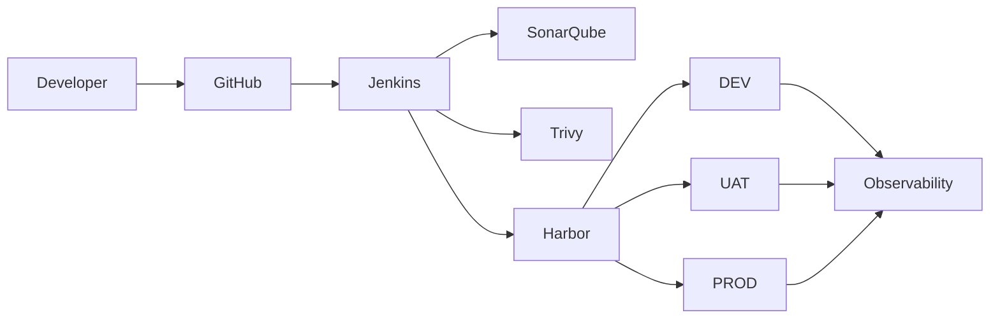

# Enterprise DevOps Blueprint

Organization-wide reference architecture and engineering standard for secure, traceable, repeatable, reviewable, recoverable, and maintainable software delivery.

---

## 1. What This Repository Is

This repository is the **central engineering standard** for how the organization designs, builds, secures, deploys, operates, and governs container-based applications.

It contains:

- architecture documentation
- delivery and deployment standards
- security and supply-chain baselines
- observability and operational standards
- runbooks and standard operating procedures
- Architecture Decision Records (ADRs)
- reusable CI/CD, container, and configuration templates
- minimal reference examples

This repository is **documentation and templates**. It is not a deployable application and it does not hold production configuration or secrets.

---

## 2. Why It Exists

Without a shared standard, each application team invents its own pipeline, tagging scheme, deployment method, and security posture. That produces:

- inconsistent release quality
- untraceable production deployments
- duplicated pipeline logic
- unclear rollback capability
- uneven security controls
- knowledge concentrated in individuals

This blueprint defines one reviewed baseline so that delivery is consistent, auditable, and transferable between teams.

---

## 3. Target Audience

| Audience | Primary use |
| --- | --- |
| Application developers | Adopt pipeline, container, and repository standards |
| DevOps / Platform engineers | Implement and operate the delivery platform |
| Security engineers | Review and strengthen the security baseline |
| SRE / Operations | Execute runbooks, monitoring, and recovery procedures |
| Engineering management | Understand roadmap, metrics, and risk posture |
| Architects | Evaluate and evolve platform decisions through ADRs |

---

## 4. Architecture Overview

Target delivery flow:



Core principles:

- Build once, promote the same immutable artifact across environments
- Environment differences live in configuration, not in separate builds
- Mandatory quality and security gates stop promotion on failure
- Production deployment is explicitly versioned, approved, and auditable
- Rollback is designed before the first production deployment

Detailed architecture documents are planned under [docs/01-architecture/](docs/01-architecture/).

---

## 5. Core Technology Stack

| Capability | Platform |
| --- | --- |
| Source control and pull requests | GitHub |
| CI/CD execution | Jenkins (self-hosted) |
| Code quality and Quality Gate | SonarQube |
| Vulnerability and misconfiguration scanning | Trivy |
| Container registry and promotion | Harbor |
| Runtime | Docker and Docker Compose on Linux |
| Operational visibility | Portainer |
| Metrics | Prometheus |
| Dashboards | Grafana |
| Log aggregation | Loki |

The architecture is intentionally kept compatible with a later evaluation of Kubernetes, GitOps, Argo CD, Vault, and policy-as-code. Those platforms are **not** adopted at this stage.

---

## 6. Repository Structure

```text
enterprise-devops-blueprint/
├── README.md                  This file
├── AGENTS.md                  Engineering and AI-governance policy (authoritative)
├── AI-BOOTSTRAP-PROMPT.md     Generation prompt used to build this repository
├── CHANGELOG.md               Versioned history of the blueprint
├── CONTRIBUTING.md            How to propose and review changes
├── SECURITY.md                Security expectations and reporting
├── docs/                      Standards and reference documentation
├── architecture/              Diagrams and decision-support material
├── standards/                 Cross-cutting engineering standards
├── templates/                 Reusable Jenkins, Docker, Compose, scanning, monitoring templates
├── examples/                  Minimal reference implementations
├── runbooks/                  Operational procedures
├── sop/                       Standard operating procedures
├── adr/                       Architecture Decision Records
├── infra/                     Platform deployment stacks (Compose, JCasC, Observability, Proxy)
└── scripts/                   Host preparation, TLS cert generation, bootstrap, and verification drills
```

---

## 7. Documentation Navigation

| Area | Location |
| --- | --- |
| Documentation index | [docs/](docs/) |
| Executive and roadmap | [docs/00-executive/](docs/00-executive/) |
| Architecture | [docs/01-architecture/](docs/01-architecture/) |
| Infrastructure | [docs/02-infrastructure/](docs/02-infrastructure/) |
| Network | [docs/03-network/](docs/03-network/) |
| Source control | [docs/04-source-control/](docs/04-source-control/) |
| CI/CD | [docs/05-ci-cd/](docs/05-ci-cd/) |
| Container | [docs/06-container/](docs/06-container/) |
| Security | [docs/07-security/](docs/07-security/) |
| Observability | [docs/08-observability/](docs/08-observability/) |
| Operations | [docs/09-operations/](docs/09-operations/) |
| Governance | [docs/10-governance/](docs/10-governance/) |
| Disaster recovery | [docs/11-disaster-recovery/](docs/11-disaster-recovery/) |
| Onboarding | [docs/12-onboarding/](docs/12-onboarding/) |
| Decisions | [adr/](adr/) |
| Templates | [templates/](templates/) |
| Platform Deployment Stacks | [infra/](infra/) |
| Automation & Setup Scripts | [scripts/](scripts/) |
| Runbooks | [runbooks/](runbooks/) |

---

## 8. How to Use This Blueprint

1. Read [AGENTS.md](AGENTS.md) — it is the authoritative policy for this repository.
2. Read the architecture and environment model in [docs/01-architecture/](docs/01-architecture/).
3. Read the CI and CD standards in [docs/05-ci-cd/](docs/05-ci-cd/).
4. Read the security baseline in [docs/07-security/](docs/07-security/).
5. Copy the relevant template from [templates/](templates/) into your application repository.
6. Adjust only what your application genuinely requires, and record deviations.

This blueprint states requirements and recommendations separately. Deviating from a requirement needs a documented exception; deviating from a recommendation needs a documented reason.

---

## 9. Adopting the Blueprint for a New Project

Planned onboarding path (documents under [docs/12-onboarding/](docs/12-onboarding/)):

1. Create the application repository on GitHub using the standard structure.
2. Apply the branching model: `feature/*` → `develop` → DEV, `release/*` → UAT, `main` → PROD.
3. Enable branch protection, required reviewers, and required CI checks.
4. Add the appropriate `Jenkinsfile` template for Angular, .NET API, or .NET Worker.
5. Add the matching `Dockerfile` and `.dockerignore` templates.
6. Register the project in SonarQube and define its Quality Gate.
7. Create the Harbor project and configure access and retention.
8. Add DEV, UAT, and PROD Compose configuration with environment-specific values.
9. Configure secrets through Jenkins Credentials or protected environment files — never in Git.
10. Register health endpoints, metrics, logs, and alerts with the observability stack.
11. Verify the rollback path before the first production release.

Reference application repository layout:

```text
project/
├── src/
├── tests/
├── docker/
├── deployment/
│   ├── dev/
│   ├── uat/
│   └── prod/
├── docs/
├── Jenkinsfile
├── Dockerfile
├── compose.yml
├── README.md
└── AGENTS.md
```

Do not create directories an application does not need.

---

## 10. Contribution Process

See [CONTRIBUTING.md](CONTRIBUTING.md).

Summary:

- Changes are proposed through a pull request.
- Significant architecture changes require an ADR in [adr/](adr/).
- Security-relevant changes require security review.
- Documentation must state purpose, scope, assumptions, and security and operational considerations.
- Unknown organization-specific values are marked `TBD`.

---

## 11. Versioning Policy

This blueprint is versioned in [CHANGELOG.md](CHANGELOG.md) using semantic-style versioning applied to standards:

| Change | Version impact |
| --- | --- |
| A requirement is added, tightened, or removed in a way that breaks existing adopters | MAJOR |
| A new standard, template, or document is added without breaking adopters | MINOR |
| Clarification, correction, or editorial change | PATCH |

Adopting projects should record which blueprint version they align with.

---

## 12. Current Status and Maturity

| Item | Status |
| --- | --- |
| Repository skeleton | Established |
| Root governance files | Established |
| Executive material | Draft for review |
| Architecture documentation | Draft for review |
| Source control standards | Draft for review |
| CI/CD standards | Draft for review |
| Network documentation | Draft for review |
| Operational runbooks | Draft for review |
| Container standards | Draft for review |
| Security standards | Draft for review |
| Observability standards | Draft for review |
| Governance | Draft for review |
| Disaster recovery | Draft for review |
| Onboarding | Draft for review |
| Standard operating procedures | Draft for review |
| Infrastructure standards | Draft for review |
| Platform runbooks | Draft for review — never executed |
| ADRs | 10 written; 0009 superseded by 0010 |
| Architecture diagrams | 6 published in [architecture/diagrams/](architecture/diagrams/) |
| Cross-cutting standards | Published in [standards/](standards/) |
| Templates | All areas drafted, covering five application types |
| Examples | Published — all 5 application types compile/type-check and tests pass in [examples/](examples/) |
| Platform implementation | Published — Compose manifests, Portainer stacks, & automation scripts in [infra/](infra/) and [scripts/](scripts/) |

**Maturity: Production Baseline (v1.0.0).** Complete architecture standards, decision records, runbooks, templates, Portainer zero-build stacks, and reference applications for all five core technology stacks are established and ready for enterprise adoption.

No claim of formal compliance, certification, audit completion, or independent security verification is made anywhere in this repository.

---

## 13. Policy Precedence

1. [AGENTS.md](AGENTS.md) — authoritative engineering and AI-governance policy
2. Nested `AGENTS.md` files, where present, may add stricter requirements
3. This `README.md` and other documentation

Where documents overlap, the stricter requirement applies. Documentation must not silently weaken `AGENTS.md`.
