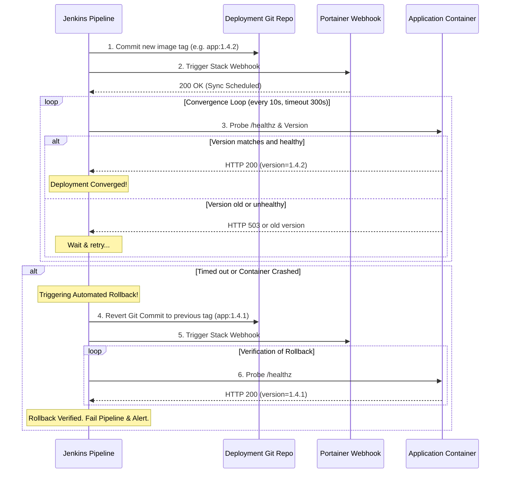

# Supporting Analysis: GitOps Convergence & Asynchronous Rollback

## 1. Context

This analysis provides the operational and architectural evaluation supporting [ADR-0010: Portainer GitOps Deployment](../../adr/0010-portainer-gitops-deployment.md).

ADR-0010 established that production deployment is **pull-based**: Portainer Stacks synchronize from a deployment Git repository triggered by a webhook, eliminating direct inbound SSH access from CI/CD to production runtime hosts.

---

## 2. The Asynchronous Convergence Problem

In a traditional push-based model (e.g. Jenkins SSH):
```text
Jenkins SSH -> Host -> docker compose up -d -> docker inspect -> Result (Synchronous)
```
The pipeline waits directly on the SSH execution and immediately knows the exit code.

In a pull-based GitOps model:
```text
Jenkins -> Git Commit -> Portainer Webhook -> Portainer schedules sync -> Host pulls image -> Container starts (Asynchronous)
```
When Portainer acknowledges the webhook with HTTP 200, **nothing has deployed yet** — Portainer has merely queued the stack synchronization.

### The Architectural Challenge
Without convergence verification:
1. Jenkins reports build success even if the image pull fails or the new container crashes in a restart loop.
2. The pipeline cannot know when smoke tests should start.
3. Automated rollback has no signal to trigger upon.

---

## 3. Options for Convergence Verification

| Option | How It Works | Trade-offs |
| --- | --- | --- |
| **Option A: Fixed Sleep Delay** | Pipeline waits 60s after webhook, then runs smoke tests. | ❌ Brittle; slow on fast deploys, fails on large image pulls; no error detection. |
| **Option B: Direct Portainer API Polling** | Jenkins polls Portainer API for container status and image SHA. | ⚠️ Requires high-privilege Portainer API token in Jenkins; couples CI to Portainer internal API. |
| **Option C: Endpoint Version Probe with Convergence Loop (Selected)** | Jenkins polls the public/ingress health endpoint (`/healthz` or `/version`) until the reported version matches the newly deployed tag. | ✅ Decoupled; tests real user-facing availability; robust timeout and rollback triggering. |

---

## 4. The Automated Rollback Sequence

The convergence loop implemented in [`templates/jenkins/deploy-gitops.sh`](../../templates/jenkins/deploy-gitops.sh) works as follows:



---

## 5. Architectural Conclusion

Pull-based GitOps satisfies enterprise network security requirements (no SSH keys across security zones) while maintaining strict deployment guarantees by wrapping the webhook in an **asynchronous convergence loop**. This ensures automated rollback remains reliable and fully functional in production.
