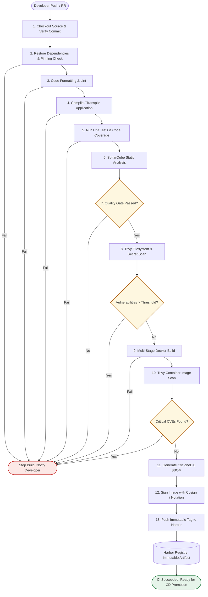

# Diagram: Continuous Integration (CI) Pipeline Standard

## 1. Purpose

Visualizes the mandatory sequential stages, fail-fast gates, security scanning, and artifact promotion flow of the standardized CI pipeline.

Implements: [docs/05-ci-cd/ci-standard.md](../../docs/05-ci-cd/ci-standard.md) and [docs/05-ci-cd/pipeline-stage-standard.md](../../docs/05-ci-cd/pipeline-stage-standard.md).

---

## 2. CI Pipeline Flowchart

---

## 3. Mandatory Governance Gates

1. **Gate 1: Unit Test & Coverage Gate** — Pipeline terminates immediately if any test fails or coverage drops below project baseline (80%).
2. **Gate 2: SonarQube Quality Gate** — Promotion stops if code smells, vulnerabilities, or maintainability ratings fail the Quality Gate.
3. **Gate 3: Trivy Security Gate** — Zero CRITICAL unmitigated vulnerabilities allowed.
4. **Gate 4: Immutable Release Identifier** — Images published to Harbor must be traceable to Git SHA and build number.
