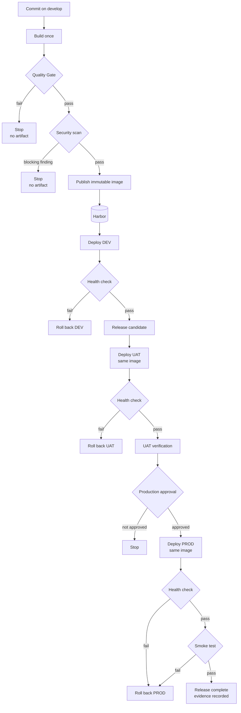

# Diagram — Environment Promotion

## Purpose

How one artifact moves from a commit through DEV and UAT into production, and where the controls sit. Referenced by architecture and CI/CD documentation.

## Status

**Draft for review.** Target flow. Gate parameters and the approver role are undecided.

## Used By

- [Environment architecture](../../docs/01-architecture/environment-architecture.md)
- [CI/CD standards](../../docs/05-ci-cd/) — planned

---

## Promotion Flow

---

## The Single Artifact

One image is built at `Build once` and the identical image is deployed three times. `Deploy UAT` and `Deploy PROD` are labelled *same image* because that is the property the whole flow exists to preserve — UAT verification is evidence about production only if production runs what UAT ran.

Only configuration differs between the three deployments. See [environment-architecture.md](../../docs/01-architecture/environment-architecture.md#6-promotion-rules).

---

## Stop Points

| Point | Stops because | Parameter |
| --- | --- | --- |
| Quality Gate | Code quality or coverage below threshold | `TBD` — gate conditions |
| Security scan | Vulnerability at or above the blocking severity | `TBD` — thresholds and exception process |
| Health check | The deployed container did not become healthy | `TBD` — definition per application type |
| Production approval | No approver authorized the release | `TBD` — approver role |
| Smoke test | Core functionality failed after deployment | `TBD` — definition per application type |

Every stop point is a mandatory control: it halts promotion rather than recording a warning. Each currently has an undefined parameter, so the flow is designed but not yet enforceable.

---

## Rollback Paths

`R1`, `R2`, and `R3` all mean the same operation — redeploy the previous known-good image — with different levels of ceremony. Only `R3` requires recorded evidence and notification.

Two dependencies constrain every rollback path:

1. **The previous image must still exist in Harbor.** Retention policy therefore determines how far back a rollback can reach. See [06-container/](../../docs/06-container/).
2. **Harbor must be reachable.** The recovery path shares its dependency with the deployment path, so a bad release during a Harbor outage has no clean recovery. See [logical-architecture.md](../../docs/01-architecture/logical-architecture.md#6-failure-isolation).

Redeploying the previous image does not undo a database migration. Where a release includes schema changes, `R3` may not be a valid recovery path at all — the release must be designed with an expand/contract migration strategy, or its rollback limitation must be documented before deployment.

---

## Related

- [Diagrams index](README.md)
- [Platform overview diagram](platform-overview.md)
- [Environment architecture](../../docs/01-architecture/environment-architecture.md)
- [CI/CD standards](../../docs/05-ci-cd/)
