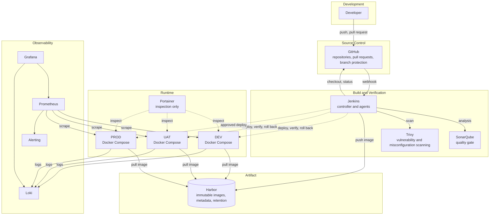

# Diagram — Platform Overview

## Purpose

The full component view of the delivery platform, including control paths and the observability stack. Referenced by more than one document, so the source is held here rather than duplicated.

## Status

**Draft for review.** Depicts a target platform, not an installed one.

## Used By

- [Enterprise DevOps architecture](../../docs/01-architecture/enterprise-devops-architecture.md)
- [Repository overview](../../README.md) — simplified form

---

## Diagram

---

## Reading Notes

**Dashed lines are control paths.** Jenkins reaching the runtime environments (deployment, health verification, rollback) is drawn dashed because the mechanism is undecided — see interaction I-06 in [service-interaction.md](../../docs/01-architecture/service-interaction.md#2-interaction-i-06-the-open-question). The direction of that connection determines the firewall design, so the diagram deliberately does not imply one.

**Runtime environments pull their own images.** The arrows to Harbor point from the environments, not from Jenkins. Harbor requires no access to the runtime hosts.

**Portainer only inspects.** Its lines are dashed and one-directional by intent. If Portainer ever gains a deployment arrow in this diagram, the governance boundary described in [10-governance/](../../docs/10-governance/) has been crossed.

**Prometheus scrapes inward.** Monitoring initiates the connection to the runtime, rather than services pushing outward. That is a deliberate access decision, not an implementation accident.

---

## Constraints Represented

- The only inbound interaction from outside the controlled network is the GitHub webhook to Jenkins.
- No arrow depicts publicly exposed SSH to production for CI/CD purposes.
- No arrow bypasses Harbor between build and runtime — every deployment retrieves a published artifact.

---

## Related

- [Diagrams index](README.md)
- [Environment promotion diagram](environment-promotion.md)
- [Service interaction](../../docs/01-architecture/service-interaction.md)
- [Logical architecture](../../docs/01-architecture/logical-architecture.md)
