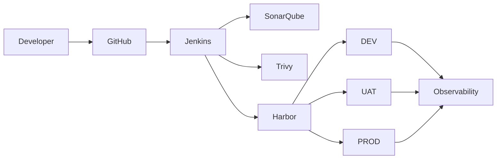

# 01 — Architecture

## Purpose

Defines the target DevOps platform architecture: components, environments, and how they interact.

## Scope

Enterprise-level and logical architecture, the DEV/UAT/PROD environment model, and service interactions. Physical server and network detail belongs in [02-infrastructure/](../02-infrastructure/) and [03-network/](../03-network/).

## Audience

Architects, platform engineers, and application teams adopting the blueprint.

## Status

**Draft for review.** All four documents are written. They describe a target architecture that has not been implemented or operationally validated.

---

## Documents

| File | Intent | Status |
| --- | --- | --- |
| [enterprise-devops-architecture.md](enterprise-devops-architecture.md) | End-to-end target architecture, design principles, component responsibilities, known weaknesses, evolution path | Draft |
| [logical-architecture.md](logical-architecture.md) | Logical planes, responsibility allocation, boundaries, control points, failure isolation, extension points | Draft |
| [environment-architecture.md](environment-architecture.md) | DEV, UAT, PROD: purpose, access, triggers, approvals, secret boundary, configuration, monitoring, backup, rollback | Draft |
| [service-interaction.md](service-interaction.md) | Interaction catalogue, key sequences, failure behaviour, credential flow | Draft |

## Reading Order

1. [enterprise-devops-architecture.md](enterprise-devops-architecture.md) — what the platform is and why
2. [logical-architecture.md](logical-architecture.md) — the plane model that makes later component substitution possible
3. [environment-architecture.md](environment-architecture.md) — how DEV, UAT, and PROD differ
4. [service-interaction.md](service-interaction.md) — the concrete calls between components

---

## Baseline Flow

---

## Design Constraints

- Build once; promote the same immutable artifact. Environment differences live in configuration.
- Production requires stricter controls than DEV and UAT.
- CI/CD infrastructure operates inside the organization's controlled network where practical.
- Production must not depend on publicly exposed SSH solely for CI/CD.
- The architecture must remain compatible with a later evaluation of Kubernetes, GitOps, Argo CD, Vault, and policy-as-code — without adopting them now.

## Principal Open Question

The mechanism by which the pipeline reaches runtime hosts is undecided, because the no-public-SSH constraint rules out the most common approach. Options and their implications are set out in [service-interaction.md](service-interaction.md#2-interaction-i-06-the-open-question).

This decision determines the CD standard, the firewall matrix, the production deployment runbook, and the rollback mechanism. It should be recorded as an ADR before those documents are written.

---

## Related

- [Documentation index](../README.md)
- [Architecture Decision Records](../../adr/)
- [Diagrams](../../architecture/diagrams/)
- [Infrastructure](../02-infrastructure/)
- [CI/CD](../05-ci-cd/)
