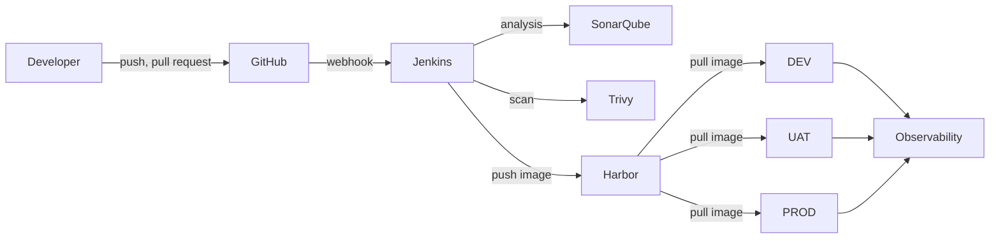
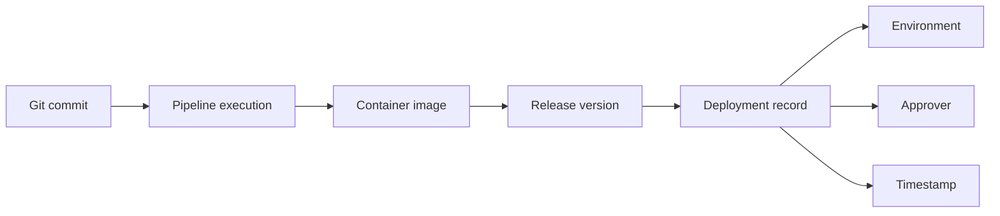

# Enterprise DevOps Architecture

## Purpose

Defines the target architecture for software delivery across the organization: which components exist, what each is responsible for, how an artifact travels from commit to production, and which properties the design must preserve.

## Scope

The end-to-end delivery platform — source control, build and verification, artifact storage, deployment, and observability — for Angular frontends, .NET Web APIs, and .NET Worker Services running as containers.

Out of scope: physical server specification ([02-infrastructure/](../02-infrastructure/)), network rules ([03-network/](../03-network/)), and pipeline implementation detail ([05-ci-cd/](../05-ci-cd/)).

## Audience

Architects, platform engineers, security engineers, and application teams adopting the blueprint.

## Status

**Draft for review.** Describes a target architecture. It is not a record of an implemented, verified platform. Nothing here has been operationally validated.

## Assumptions

- Delivery targets are containerized applications of the three types listed above.
- CI/CD infrastructure runs on organization-controlled Linux hosts.
- Application teams are small enough that a shared platform team can operate the toolchain centrally.
- Kubernetes is not adopted at this stage.

---

## 1. Architecture Goals

`AGENTS.md` states the repository mission as delivery that is secure, traceable, repeatable, reviewable, recoverable, and maintainable. Those words only mean something if each maps to a mechanism that can be pointed at.

| Goal | Mechanism that delivers it | Fails if |
| --- | --- | --- |
| Traceable | Immutable image identity carrying the Git commit; deployment records linking commit, pipeline, image, approver, time | Images are tagged `latest`, or deployments happen outside the pipeline |
| Repeatable | Build once, promote the same artifact; pinned base images; pipeline defined as code | Each environment rebuilds from source |
| Reviewable | Pull requests before protected-branch merges; pipeline and configuration in Git | Changes reach production without review |
| Secure | Quality and security gates that block promotion; secrets outside Git; least privilege; scanning at build and artifact level | Gates are advisory, or credentials live in the repository |
| Recoverable | Rollback designed before first production deploy; previous known-good image retained; tested backups | Rollback is improvised during an incident |
| Maintainable | Shared pipeline templates over copied logic; documented standards; ADRs for significant decisions | Every team maintains a divergent pipeline |

A goal without an enforcing mechanism is an aspiration. Where the mechanism is not yet built, this document says so.

---

## 2. Design Principles

### 2.1 Build once, promote the same artifact

A container image is built exactly once, from one commit, and that same image is deployed to DEV, then UAT, then PROD.

The reason is evidential: testing in UAT only tells you something about production if the thing in production is the thing that was tested. Rebuilding per environment breaks that chain — dependency resolution, base image contents, and build tooling can all differ between builds of identical source.

Consequence: environment-specific values cannot be compiled into the artifact. See [environment-architecture.md](environment-architecture.md).

### 2.2 Configuration is supplied at run time

The image contains the application. The environment supplies configuration and secrets.

This is the constraint that makes 2.1 possible. It is also the requirement that Angular applications complicate, because a naive Angular build bakes the API URL into the bundle at compile time. That case needs a runtime configuration mechanism rather than an exception to the principle.

### 2.3 Identity is immutable and traceable

Every deployable artifact has an identifier that resolves to exactly one build, forever.

```text
app:1.4.2
app:1.4.2-a82f912
app:sha-a82f912
```

`latest` is a moving pointer and is never the production deployment identifier. "Which version is in production?" must have a precise answer, and "the latest one" is not one.

### 2.4 Gates block, they do not warn

A mandatory quality or security gate that fails must stop promotion. A gate that logs a warning and continues is not a control; it is a report that nobody reads.

Which gates are mandatory, and the severity thresholds that trip them, are `TBD` — see [05-ci-cd/](../05-ci-cd/) and [07-security/](../07-security/).

### 2.5 Rollback is designed before the first production deployment

Rollback capability is part of the deployment design, not a response to an incident. The previous known-good image is recorded before deployment, not reconstructed afterwards.

Database migrations can make rollback unsafe or impossible. That limitation is documented rather than papered over. Automatic rollback is never promised for irreversible database changes.

### 2.6 Least privilege and controlled exposure

Each component gets the minimum access required. Administrative interfaces are not publicly exposed without explicit justification and compensating controls. CI/CD infrastructure operates inside the organization's controlled network where practical.

### 2.7 Prefer simple and reliable over fashionable

Platform complexity is a permanent operational cost paid by whoever is on call. New platforms are adopted when a requirement justifies them, not because they are current practice elsewhere.

---

## 3. Platform Components

| Component | Responsibility | Explicitly not responsible for |
| --- | --- | --- |
| GitHub | Repository hosting, pull requests, code review, branch protection, source history | Executing CI/CD as primary infrastructure |
| Jenkins | Checkout, build, test, analysis, scanning, image build and push, deployment orchestration, health verification, rollback orchestration, audit trail | Storing long-lived artifacts; being a source of truth for configuration |
| SonarQube | Static analysis, quality measurement, coverage integration, Quality Gate enforcement | Security vulnerability scanning of dependencies or images |
| Trivy | Vulnerability scanning of filesystems, dependencies, and images; misconfiguration and secret detection | Code quality or maintainability assessment |
| Harbor | Image storage, access control, retention, vulnerability metadata, promotion support, artifact traceability | Building images; deciding what is deployed |
| Docker / Compose | Container runtime and composition on each host | Orchestration across hosts; automatic rescheduling |
| Portainer | Operational visibility, controlled troubleshooting, container inspection | Being a deployment path that bypasses CI/CD |
| Prometheus | Metric collection and retention | Long-term log storage |
| Grafana | Dashboards and visualization across metrics and logs | Being the alerting source of truth for pipeline state |
| Loki | Centralized log aggregation and search | Storing metrics |

The "not responsible for" column matters more than it looks. Most platform decay starts when a component quietly acquires a second job — Portainer becoming a deployment tool, or Jenkins becoming a configuration store.

---

## 4. End-to-End Flow



The detailed component view, including the observability stack and control paths, is in [platform-overview.md](../../architecture/diagrams/platform-overview.md). Concrete interactions, protocols, and authentication are in [service-interaction.md](service-interaction.md).

---

## 5. The Traceability Chain

Every production deployment must be answerable in both directions: from a running container back to the commit that produced it, and from a commit forward to where it is running.



The image identifier is what holds this chain together. It embeds or resolves to the commit, and every deployment record references it. Break that link — by retagging an image, by deploying `latest`, or by deploying outside the pipeline — and the chain is severed for every artifact downstream of the break.

Harbor must therefore protect production artifacts against replacement. The specific mechanism (project-level immutability rules) is `TBD` in [06-container/](../06-container/).

---

## 6. Control and Trust Boundaries

| Boundary | Separates | Enforced by |
| --- | --- | --- |
| Review boundary | Unreviewed work from protected branches | Branch protection, required reviewers, required checks |
| Quality boundary | Unverified code from a publishable artifact | Quality Gate and security scans in the pipeline |
| Artifact boundary | Arbitrary images from deployable images | Harbor access control and retention |
| Approval boundary | UAT-verified releases from production | Manual production approval |
| Secret boundary | Each environment's credentials from every other environment's | Separate credential scopes per environment |
| Change boundary | Governed change from manual drift | Change management and deployment audit trail |

The secret boundary is the one most often broken in practice, usually by convenience: a single credential reused across DEV, UAT, and PROD turns a low-value development compromise into a production compromise. Environment-specific credentials are a requirement, not a preference.

---

## 7. Technology Decisions

Each baseline decision is to be recorded as an ADR. None have been written yet.

| Decision | ADR | Status |
| --- | --- | --- |
| Jenkins as CI/CD execution platform | `adr/0001-use-jenkins-for-ci-cd.md` | Planned |
| Harbor as container registry | `adr/0002-use-harbor-as-container-registry.md` | Planned |
| SonarQube for code quality | `adr/0003-use-sonarqube-for-code-quality.md` | Planned |
| Trivy for container security | `adr/0004-use-trivy-for-container-security.md` | Planned |
| Docker Compose as initial runtime | `adr/0005-use-docker-compose-for-initial-runtime.md` | Planned |
| Prometheus, Grafana, Loki for observability | `adr/0006-use-prometheus-grafana-loki.md` | Planned |
| Immutable container versioning | `adr/0007-use-immutable-container-versioning.md` | Planned |
| Manual production approval | `adr/0008-production-manual-approval.md` | Planned |

See [adr/](../../adr/). These represent blueprint decisions made when this architecture was established, not a record of historical debate.

---

## 8. Constraints and Non-Goals

Constraints that shape the design:

- GitHub-hosted runners are not the primary CI/CD execution infrastructure. Build execution stays on organization-controlled hosts.
- Production must not depend on publicly exposed SSH solely for CI/CD. The deployment mechanism that satisfies this is `TBD` and is the most significant open architectural question — see [service-interaction.md](service-interaction.md).
- Production administrative interfaces are not publicly exposed without justification and compensating controls.
- Portainer must not become a deployment path that bypasses CI/CD governance.

Explicit non-goals at this stage:

- Kubernetes, GitOps, and Argo CD
- HashiCorp Vault or an equivalent secret-management platform
- Policy-as-code enforcement engines
- An internal developer platform or self-service portal
- Multi-region or active-active availability

These are deferred, not rejected. Section 10 describes what would justify each.

---

## 9. Known Architectural Weaknesses

Stated plainly, because a design document that lists only strengths is not useful for planning.

| Weakness | Consequence | Current mitigation |
| --- | --- | --- |
| Jenkins is a single point of failure | No builds, no deployments, no rollback orchestration while it is down | None yet. Backup and restore of controller configuration is required — `TBD` in [11-disaster-recovery/](../11-disaster-recovery/) |
| Harbor is a single point of failure | No deployments and no rollbacks, because both pull images from it | None yet. A host-local image cache would reduce, not remove, this |
| Single-host runtime per environment | Host loss takes the environment down; no automatic rescheduling | Accepted at this scale. Removing it means orchestration, which is deferred |
| Rollback depends on Harbor availability | The recovery path shares a dependency with the failure path | Not yet addressed |
| Jenkins holds credentials for all environments | Compromise of the controller is a broad compromise | Credential scoping per environment; further controls `TBD` |
| Manual approval depends on a person being available | Release throughput is bounded by approver availability | Accepted deliberately as the cost of the control |

The concentration of failure in Jenkins and Harbor is the defining reliability characteristic of this architecture. Both are correct choices at this scale, and both should be revisited when delivery frequency makes their downtime expensive.

---

## 10. Evolution Path

The architecture is designed so that later change replaces a component rather than requiring redesign. The boundaries in [logical-architecture.md](logical-architecture.md) are what make that possible.

| Phase | Focus |
| --- | --- |
| 1 — Foundation | Repository standards, Jenkins, Harbor, SonarQube, Trivy, DEV pipeline |
| 2 — Controlled delivery | UAT, production approval, immutable releases, rollback, audit trail |
| 3 — Security | SBOM, image signing, secret scanning, stronger credential controls |
| 4 — Observability | Prometheus, Grafana, Loki, alerts, operational dashboards |
| 5 — Platform engineering | Jenkins Shared Library, project templates, self-service bootstrap |
| 6 — Runtime evolution | Evaluate Kubernetes, GitOps, Argo CD, Vault, policy-as-code |

What would justify moving to Phase 6, rather than a preference for it:

| Candidate | Justified when |
| --- | --- |
| Kubernetes | Single-host failure becomes unacceptable, or workload count makes manual placement impractical |
| GitOps / Argo CD | Deployment volume makes push-based orchestration a bottleneck, or drift detection becomes a real operational need |
| Vault | Secret count, rotation frequency, or audit requirements exceed what Jenkins Credentials can serve |
| Policy-as-code | Standards exist and are stable, but manual review no longer scales to enforce them |

Adopting any of these before the corresponding pain exists adds operational complexity with no return.

---

## 11. Open Items

| Item | Blocks |
| --- | --- |
| `TBD` — deployment mechanism to runtime hosts, given the no-public-SSH constraint | CD standard, service interactions, production runbook |
| `TBD` — Harbor, Jenkins, and SonarQube URLs and network placement | Network architecture, firewall matrix |
| `TBD` — production approver role | Production approval flow, governance |
| `TBD` — severity thresholds that block promotion | CI standard, vulnerability management |
| `TBD` — Angular runtime configuration mechanism | Build-once principle for frontend applications |
| `TBD` — whether observability shares the toolchain host or is separated | Infrastructure sizing, failure isolation |

---

## Security Considerations

The architecture concentrates significant trust in Jenkins: it holds credentials for every environment, and it is the component authorized to publish artifacts and change production. Compromise of the Jenkins controller is effectively compromise of the delivery chain. Credential isolation, restricted administrative access, and controller backup are therefore load-bearing controls, not hygiene.

The second concentration is Harbor. An attacker able to replace an image in Harbor can put arbitrary code into production through an entirely legitimate deployment path, with a valid audit trail. Artifact immutability and registry access control are what prevent this.

No security claim in this document has been independently verified. Detailed controls are defined in [07-security/](../07-security/).

## Operational Considerations

Day-to-day operation requires: keeping Jenkins and its agents patched and backed up; managing Harbor storage growth and retention; maintaining SonarQube's database; and keeping the observability stack itself observable.

The failure modes that matter most are Jenkins unavailable (delivery stops) and Harbor unavailable (delivery *and* rollback stop). Both are documented in [11-disaster-recovery/](../11-disaster-recovery/), and neither has a tested recovery procedure yet. Until a restore has been demonstrated, recovery capability is unproven.

---

## Related

- [Logical architecture](logical-architecture.md)
- [Environment architecture](environment-architecture.md)
- [Service interaction](service-interaction.md)
- [Platform overview diagram](../../architecture/diagrams/platform-overview.md)
- [Architecture Decision Records](../../adr/)
- [Engineering and AI-governance policy](../../AGENTS.md)
