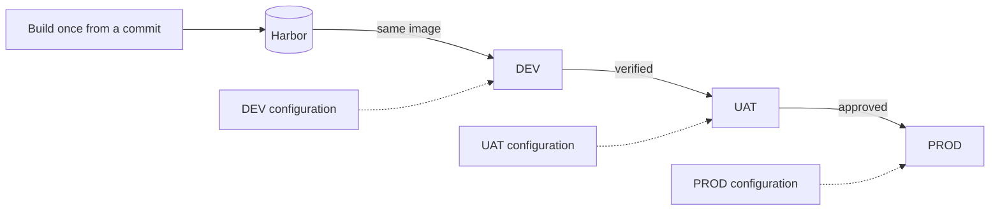

# Environment Architecture

## Purpose

Defines the DEV, UAT, and PROD environments: what each is for, who can reach it, how deployment is triggered and approved, where its secrets and configuration come from, and how it is monitored, backed up, and rolled back.

## Scope

The environment model and the promotion rules between environments. Pipeline implementation is in [05-ci-cd/](../05-ci-cd/); host specification is in [02-infrastructure/](../02-infrastructure/).

## Audience

Application teams, platform engineers, release approvers, and operations.

## Status

**Draft for review.** Target model. Access policies and approval roles are not yet assigned.

---

## 1. Environment Model



Three environments, one artifact. The image is built once and promoted unchanged; only the configuration supplied to it differs. The promotion path in detail is in [environment-promotion.md](../../architecture/diagrams/environment-promotion.md).

Controls tighten as the artifact moves right. Production is not DEV with more caution — it has different access rules, a different approval requirement, and a different secret boundary.

---

## 2. Environment Comparison

| Attribute | DEV | UAT | PROD |
| --- | --- | --- | --- |
| Purpose | Integration verification of merged work | Acceptance and release-candidate verification | Live service delivery |
| Deployment trigger | Automatic on merge to `develop` | On `release/*` branch, automatic or on request | Manual, after approval |
| Approval required | None | `TBD` | Yes — explicit, recorded |
| Artifact source | Harbor | Harbor, same image as DEV | Harbor, same image as UAT |
| Who may deploy | Pipeline | Pipeline | Pipeline, after approval by `TBD` role |
| Who may access the host | `TBD` — developers and platform team | `TBD` — platform team | `TBD` — restricted, platform team only |
| Data | Synthetic or anonymized | Representative, non-production | Live production data |
| Secret scope | DEV-only credentials | UAT-only credentials | PROD-only credentials |
| Monitoring | Basic health and metrics | Health, metrics, logs | Full: health, metrics, logs, alerts, dashboards |
| Alerting | None or low-severity only | Low-severity | Actionable alerts routed to on-call |
| Backup | Not required | `TBD` | Required — see [11-disaster-recovery/](../11-disaster-recovery/) |
| Rollback | Redeploy any prior image | Redeploy prior image | Documented, verified, evidenced |
| Change control | None | Lightweight | Full — recorded with approver and reference |

Empty cells are not oversights. Access policy per environment is a decision for whoever owns production access, and inventing it here would produce a document that reads as authoritative while describing nothing real.

---

## 3. DEV

**Purpose.** Verify that merged work integrates and functions. This is the first environment where changes from different developers meet.

**Trigger.** Automatic deployment on merge to `develop`, following a successful pipeline.

**Access.** `TBD`. Broader than UAT and PROD by design — developers need to diagnose their own failures here.

**Secret boundary.** DEV credentials only. No credential in DEV may grant access to UAT or PROD systems. This is worth stating precisely because DEV is the environment with the widest access and the weakest data sensitivity, which makes it the natural pivot point for an attacker.

**Data.** Synthetic or anonymized. Production data must not be copied into DEV. Where realistic data is genuinely required for a defect investigation, that is an exception requiring approval — `TBD` in [10-governance/](../10-governance/).

**Configuration.** Environment-specific, supplied at run time. DEV may enable verbose logging and diagnostic endpoints that must not be enabled elsewhere.

**Monitoring.** Health checks and basic metrics. Alerting is optional; a noisy DEV alert channel trains people to ignore alerts, which then costs them in production.

**Rollback.** Redeploy any prior image. No approval required.

**Backup.** Not required. DEV is expected to be reconstructible from the pipeline.

---

## 4. UAT

**Purpose.** Acceptance verification of a release candidate. What is verified here is what is intended to reach production — unchanged.

**Trigger.** Deployment of a `release/*` build. Whether this is automatic or on request is `TBD`.

**Access.** `TBD`. Narrower than DEV, because a UAT environment that anyone can modify cannot serve as evidence of anything.

**Secret boundary.** UAT credentials only, distinct from both DEV and PROD.

**Data.** Representative of production in shape and volume, but not production data. Where production-derived data is used, it must be anonymized before it arrives — anonymization performed inside UAT means the raw data was already there.

**Configuration.** Should mirror production as closely as the environment allows. Every deliberate divergence from production configuration is a gap in what UAT actually proves, and should be recorded — see section 8.

**Monitoring.** Health, metrics, and logs. Low-severity alerting.

**Rollback.** Redeploy the prior image. Approval `TBD`.

**Backup.** `TBD`. Depends on whether UAT holds state that would be expensive to recreate.

---

## 5. PROD

**Purpose.** Live service delivery to real users with real data.

**Trigger.** Manual, and only after: a successful pipeline, passing quality and security gates, UAT verification, and explicit approval.

```text
Release Candidate
Quality Gate
Security Gate
UAT Verification
Production Approval
Deployment
Health Verification
Smoke Test
```

**Approval.** Required, by `TBD` role. Each production deployment records approver, version, deployment time, and change or ticket reference.

**Access.** `TBD` — restricted. Production host access is a governed capability, not a role attribute. Production administrative interfaces are not publicly exposed without explicit justification and compensating controls.

**Secret boundary.** PROD credentials only, and they exist nowhere else. Not in DEV, not in UAT, not in a developer's local environment, not in a repository.

**Configuration.** Environment-specific, supplied at run time, sourced from outside Git. An explicit image version is always specified — never `latest`.

**Monitoring.** Full: health endpoints, metrics, structured logs, dashboards, and actionable alerting routed to on-call.

**Rollback.** Documented and verified before the first production deployment, not designed during an incident:

```text
1. Record the current known-good version
2. Deploy the requested immutable image
3. Execute health checks
4. Execute smoke tests
5. Restore the previous version on failure, where technically safe
6. Verify recovery
7. Record failure evidence
8. Notify responsible engineers
```

"Where technically safe" is doing real work in step 5. A schema migration that dropped a column cannot be undone by redeploying the previous image — the old code will fail against the new schema. Database rollback limitations are documented in [05-ci-cd/](../05-ci-cd/) and must be understood before a release containing migrations.

**Backup.** Required, with restore testing. Until a restore has been demonstrated, recovery capability is unproven and must be described that way.

---

## 6. Promotion Rules

### What must be identical across environments

- The container image, byte for byte, referenced by the same immutable identifier
- The application code and its compiled dependencies
- The base image

### What may differ

- Endpoint addresses, connection strings, and external service URLs
- Credentials and certificates
- Log verbosity
- Resource limits and replica counts
- Feature flag values
- Diagnostic endpoints enabled in DEV but not elsewhere

### What must never happen

- Rebuilding the artifact per environment, absent a documented technical requirement
- Deploying to PROD an image that did not pass through UAT
- Using `latest` as the production deployment identifier
- Retagging or replacing an image already deployed to any environment
- Sharing a credential across environments
- Deploying manually, outside the pipeline, without change control

The third and fourth items break the traceability chain described in [enterprise-devops-architecture.md](enterprise-devops-architecture.md#5-the-traceability-chain), and they break it retroactively — once an identifier has pointed at two different builds, no deployment record referencing it can be trusted.

---

## 7. Configuration and Secret Model

### Configuration precedence

```text
1. Environment-specific configuration supplied at run time   (highest)
2. Environment-specific defaults in deployment configuration
3. Application defaults built into the image                 (lowest)
```

Application defaults must be safe if nothing overrides them. A default that points at a production endpoint, or that disables a security control, is a defect — the failure mode of a missing override should be "does not start", not "starts and connects to production".

### Where values live

| Value type | Location | In Git? |
| --- | --- | --- |
| Non-sensitive environment configuration | Environment-specific deployment configuration | Yes, if it contains no internal addresses |
| Internal endpoints and hostnames | Environment-specific configuration, held outside Git | No |
| Credentials, tokens, keys, connection strings | Jenkins Credentials, protected environment files, or host-managed secrets | Never |
| Placeholder examples | `*.env.example` | Yes, placeholders only |

Approved secret mechanisms at this stage: Jenkins Credentials, environment-specific protected `.env` files held outside Git, and host-managed secrets. Vault or equivalent may be recommended later based on scale and risk — see [07-security/](../07-security/).

### The Angular problem

An Angular application compiled with environment values baked into the bundle cannot be promoted — each environment needs a different bundle, which means a different artifact, which breaks build-once.

The resolution is a runtime configuration mechanism: the container reads its configuration when it starts, not when it is built. The specific mechanism is `TBD` and is demonstrated in [examples/angular/](../../examples/angular/).

This is not an Angular-specific curiosity. Any build-time-configured artifact has the same defect; the frontend just makes it obvious.

---

## 8. Environment Parity

Perfect parity between UAT and PROD is rarely achievable. What matters is knowing precisely where the gaps are, because each gap is a class of defect UAT cannot catch.

Divergences to record once the environments exist:

| Dimension | Why it matters |
| --- | --- |
| Data volume | Performance and query behaviour differ at scale |
| Data shape | Real data contains cases synthetic data does not |
| External dependencies | Mocked or shared dependencies do not fail like real ones |
| Resource limits | Memory limits that hold in UAT may not hold under production load |
| Network topology | Latency, segmentation, and TLS termination differ |
| Concurrency | Contention and race conditions appear under real load |
| Configuration | Any deliberate difference is a difference in what was tested |

`TBD` — the actual divergence register, to be completed when the environments are built. An empty parity section is honest at this stage; a fabricated one would not be.

---

## 9. Open Items

| Item | Affects |
| --- | --- |
| `TBD` — access policy per environment, by role | Production access policy, onboarding |
| `TBD` — production approver role | Production approval, governance |
| `TBD` — UAT deployment trigger: automatic or on request | CD standard |
| `TBD` — UAT approval requirement | CD standard |
| `TBD` — UAT backup requirement | Disaster recovery |
| `TBD` — smoke test definition per application type | Deployment verification, rollback trigger |
| `TBD` — Angular runtime configuration mechanism | Build-once for frontend applications |
| `TBD` — environment parity divergence register | Confidence in UAT verification |
| `TBD` — deployment mechanism to each environment's hosts | All three environments |

---

## Security Considerations

The environment model's primary security property is the secret boundary: three separate credential sets, with no value shared between them. Its most likely failure is convenience — one Harbor credential, one database password, one API key reused across environments because it is simpler. That reuse converts a compromise of the least protected environment into a compromise of the most protected one, and it does so silently.

Production data appearing in DEV or UAT is the second failure mode. It arrives through defect investigation, performance testing, and data migration rehearsals, each with a plausible justification. Where it is genuinely necessary, it is an approved, recorded exception.

## Operational Considerations

Each environment carries ongoing cost: hosts, storage, monitoring, and someone to keep it working. UAT in particular tends to decay — it is nobody's production and everybody's second priority — until a release fails because UAT no longer resembled production. Whoever owns UAT parity should be named. That ownership is `TBD` in [10-governance/](../10-governance/).

---

## Related

- [Enterprise DevOps architecture](enterprise-devops-architecture.md)
- [Logical architecture](logical-architecture.md)
- [Service interaction](service-interaction.md)
- [Environment promotion diagram](../../architecture/diagrams/environment-promotion.md)
- [CI/CD standards](../05-ci-cd/)
- [Security standards](../07-security/)
- [Disaster recovery](../11-disaster-recovery/)
