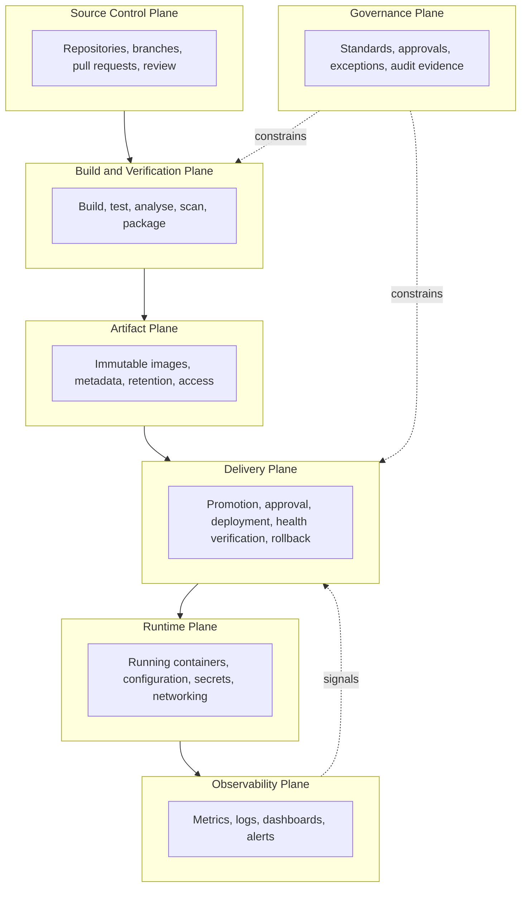

# Logical Architecture

## Purpose

Describes the delivery platform as a set of logical planes with defined responsibilities and boundaries, independent of which product implements each one.

## Scope

Logical decomposition, responsibility allocation, control points, boundaries, and failure isolation. Product-specific behaviour is in [enterprise-devops-architecture.md](enterprise-devops-architecture.md); concrete calls between components are in [service-interaction.md](service-interaction.md).

## Audience

Architects and platform engineers, particularly when evaluating a component replacement.

## Status

**Draft for review.** Target design, not an implemented system.

## Why a Logical View

The physical view answers "what is installed". The logical view answers "what job is being done, and what would replace it".

That distinction is what makes the evolution path in [enterprise-devops-architecture.md](enterprise-devops-architecture.md#10-evolution-path) achievable. Kubernetes replaces the runtime plane; Argo CD replaces deployment orchestration within the delivery plane; Vault replaces the secret store. Each is a plane-level substitution, and each is only cheap if the plane's boundaries were respected while the previous implementation was in use.

---

## 1. Planes

| Plane | Question it answers | Current implementation |
| --- | --- | --- |
| Source Control | What change is proposed, and who reviewed it? | GitHub |
| Build and Verification | Does this change meet quality and security requirements? | Jenkins, SonarQube, Trivy |
| Artifact | What exactly is deployable, and can it be trusted not to change? | Harbor |
| Delivery | What goes where, on whose authority, and how is failure handled? | Jenkins |
| Runtime | Where does it actually run, with what configuration? | Docker, Docker Compose, Portainer |
| Observability | What is it doing, and is it healthy? | Prometheus, Grafana, Loki |
| Governance | What is allowed, who decides, and what evidence remains? | Documentation, review process, audit records |

Jenkins currently implements two planes: build and verification, and delivery. That is a deliberate simplification at this scale, and it is also the coupling that a future GitOps adoption would break apart. Keeping the two concerns distinct inside the pipeline — verification produces an artifact, delivery consumes one — is what keeps that option open.

---

## 2. Responsibility Allocation

| Plane | Owns | Consumes | Must not |
| --- | --- | --- | --- |
| Source Control | Source history, review record, branch protection state | Developer changes | Store secrets or built artifacts |
| Build and Verification | Build reproducibility, test and analysis results, gate verdicts, SBOM | Source, dependencies, base images | Deploy to any environment |
| Artifact | Artifact identity, immutability, retention, vulnerability metadata | Images from the build plane | Modify an artifact's content under an existing identifier |
| Delivery | Promotion decisions, approval enforcement, deployment execution, health verification, rollback, audit records | Artifacts, approvals, environment configuration | Rebuild an artifact, or deploy something the artifact plane does not hold |
| Runtime | Process execution, environment configuration, secret injection, local networking | Artifacts, configuration, secrets | Be modified outside the delivery plane |
| Observability | Signal collection, retention, dashboards, alert evaluation | Runtime signals | Be the only record of what was deployed |
| Governance | Standards, decision rights, exceptions, evidence retention | All planes | Be bypassed for convenience |

The runtime plane's "must not" is the one under constant pressure. Portainer makes manual container changes easy, and easy manual changes are how environments drift out of correspondence with what the delivery plane believes is deployed. Portainer's legitimate role is inspection and approved operational tasks; it is not an alternative delivery plane.

---

## 3. Boundaries

| Boundary | Between | Crossing requires | Consequence of a leak |
| --- | --- | --- | --- |
| Review | Developer work and protected branches | Pull request, review, passing checks | Unreviewed code becomes a candidate for release |
| Verification | Source and deployable artifact | Passing all mandatory gates | Untested or vulnerable code becomes deployable |
| Artifact | Build output and deployment input | Publication to Harbor under an immutable identifier | Deployment of something that was never verified |
| Approval | UAT and production | Explicit human approval, recorded | Unapproved change in production |
| Secret | Each environment's credentials | Nothing — this boundary must not be crossed | A DEV compromise becomes a PROD compromise |
| Change | Governed change and manual action | Change control, recorded | The audit trail stops describing reality |

The secret boundary is the only one in this table with no legitimate crossing. Credentials are per-environment. A shared credential does not save operational effort; it converts every environment into the security posture of the weakest one.

---

## 4. Artifact and Metadata Model

The artifact is a container image. What makes it usable as an evidence object is the metadata bound to it.

| Attribute | Purpose | Source |
| --- | --- | --- |
| Image identifier | Unique, immutable reference to one build | Build plane |
| Git commit | Links the artifact to reviewed source | Build plane |
| Release version | Human-meaningful identity for release management | Build plane |
| Pipeline execution reference | Links to build logs, test results, gate verdicts | Build plane |
| Scan results | Vulnerability posture at build time | Trivy, stored by artifact plane |
| SBOM | Component inventory for later vulnerability response | Build plane |
| Signature | Evidence the artifact came from the expected pipeline | Build plane, once signing is implemented |

SBOM and signing are the pair worth understanding together. Without an SBOM, answering "which of our running services contain this newly disclosed vulnerable library?" means rebuilding and rescanning everything. Without a signature, Harbor's access control is the only thing asserting an image's provenance.

Neither is implemented yet. Both are Phase 3 — see [07-security/](../07-security/).

---

## 5. Control Points

A control point is where the flow can be stopped. These are the mechanisms behind the goals in [enterprise-devops-architecture.md](enterprise-devops-architecture.md#1-architecture-goals).

| Control point | Plane | Blocks | Authority | Status |
| --- | --- | --- | --- | --- |
| Branch protection and required review | Source Control | Merge to a protected branch | Repository configuration | `TBD` — reviewer count, required checks |
| Required CI checks | Build and Verification | Merge | Pipeline result | `TBD` |
| Quality Gate | Build and Verification | Promotion past build | SonarQube gate definition | `TBD` — conditions |
| Security scan threshold | Build and Verification | Publication or promotion | Severity policy | `TBD` — thresholds |
| Registry access control | Artifact | Publication and retrieval | Harbor project permissions | `TBD` — robot account model |
| Artifact immutability | Artifact | Replacement of an existing identifier | Harbor project configuration | `TBD` |
| Production approval | Delivery | Production deployment | Named approver role | `TBD` — which role |
| Health verification | Delivery | Completion of a deployment, triggers rollback | Automated check | `TBD` — definition per application type |
| Change control | Governance | Manual production change | Change process | `TBD` |

Nine control points, and every one has an undefined parameter. That is expected at this stage — the architecture identifies where control belongs, and the corresponding standards define the values. It is also the reason this architecture cannot yet be described as enforced.

---

## 6. Failure Isolation

Plane-level view: what capability is lost when a plane is unavailable. Interaction-level failure behaviour is in [service-interaction.md](service-interaction.md#4-failure-behaviour).

| Plane unavailable | Lost immediately | Still working | Recovery priority |
| --- | --- | --- | --- |
| Source Control | New changes, review, merges | Running services, existing artifacts, deployment of an existing artifact | Medium — delivery of *existing* artifacts continues |
| Build and Verification | New builds, all promotion | Running services; rollback if it does not depend on the pipeline | High |
| Artifact | Deployment **and rollback** | Running services | Critical |
| Delivery | Deployment, orchestrated rollback | Running services, manual intervention | High |
| Runtime | The service itself | Everything else | Critical for that environment |
| Observability | Detection, alerting, diagnosis | Everything — but blind | High, and often underestimated |

Two entries deserve attention.

**Artifact plane loss is critical** because rollback pulls from the same registry as deployment. The recovery path shares a dependency with the failure path, so a bad release coinciding with Harbor being unavailable leaves no clean way back. A host-local image cache would reduce this; it is not currently designed.

**Observability plane loss is underestimated** because nothing stops working. Deployments still succeed, services still run, and the platform appears healthy — while no one can see whether it is. This is the failure mode most likely to be discovered late, during an unrelated incident.

---

## 7. Extension Points

Where a future change substitutes an implementation without redesigning the architecture.

| Change | Replaces | Preconditions |
| --- | --- | --- |
| Kubernetes | Runtime plane implementation | Artifact identity and configuration model already environment-independent |
| Argo CD / GitOps | Deployment orchestration within the Delivery plane | Deployment state expressed declaratively; artifact plane unchanged |
| Vault | Secret storage behind the Runtime and Delivery planes | Secrets already referenced indirectly, never embedded |
| Policy-as-code | Automated enforcement in the Governance plane | Standards written, stable, and machine-expressible |
| Jenkins Shared Library | Duplicated pipeline logic in Build and Delivery | Pipeline stages standardized across application types |

Every one of these depends on discipline maintained *now*, before the change is contemplated. Secrets referenced indirectly today make Vault adoption a configuration change; secrets embedded in Compose files today make it a migration project. The extension point is only cheap if the boundary was respected while it was still theoretical.

---

## 8. Open Items

| Item | Affects |
| --- | --- |
| `TBD` — how the Delivery plane reaches runtime hosts without publicly exposed SSH | Delivery plane design, Phase 2 |
| `TBD` — whether deployment state is declarative or imperative | GitOps extension point viability |
| `TBD` — image caching or mirroring to decouple rollback from Harbor availability | Failure isolation |
| `TBD` — all nine control point parameters in section 5 | Whether controls are enforced or merely defined |
| `TBD` — SBOM storage location and query mechanism | Vulnerability response capability |

---

## Security Considerations

The plane model exists partly to make blast radius explicit. Compromise of the Build and Verification plane yields the ability to publish arbitrary artifacts; compromise of the Artifact plane yields the ability to substitute what is deployed; compromise of the Delivery plane yields both, plus credentials for every environment.

Jenkins currently implements two of those three planes and holds the credentials for the third. This is the architecture's most significant security concentration and is stated again here because it is a property of the *logical* design, not an implementation detail that a different tool choice would remove.

## Operational Considerations

The planes do not map one-to-one to operational ownership. A single platform team currently operates the build, artifact, delivery, and observability planes, while application teams own what runs in the runtime plane. Where that ownership line falls determines who is paged for what, and it is not yet documented — see [10-governance/](../10-governance/).

---

## Related

- [Enterprise DevOps architecture](enterprise-devops-architecture.md)
- [Environment architecture](environment-architecture.md)
- [Service interaction](service-interaction.md)
- [Security standards](../07-security/)
- [Governance](../10-governance/)
