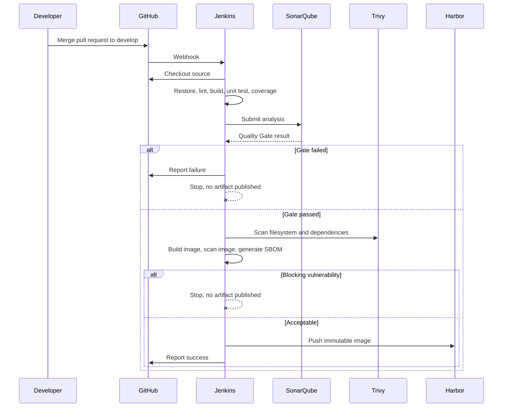
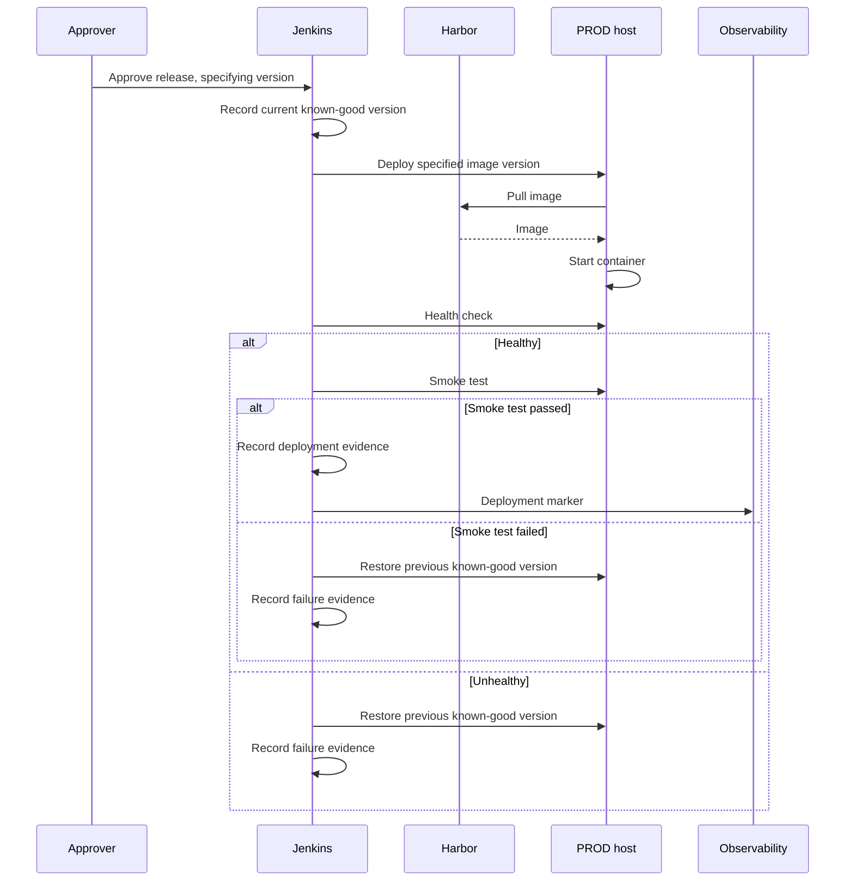
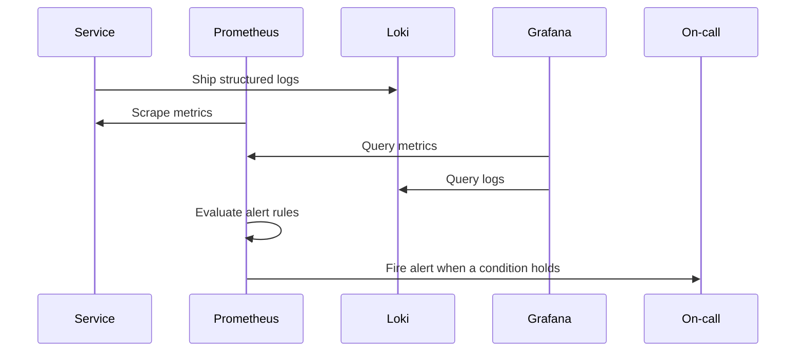

# Service Interaction

## Purpose

Catalogues the interactions between platform components: who calls whom, in which direction, for what purpose, authenticated how, and what happens when the target is unavailable.

## Scope

Component-to-component interactions within the delivery platform. Network segmentation, ports, and firewall rules are derived from this catalogue in [03-network/](../03-network/). Plane-level failure isolation is in [logical-architecture.md](logical-architecture.md#6-failure-isolation).

## Audience

Platform engineers, network engineers, and security engineers.

## Status

**Draft for review.** Interaction I-06 — the delivery mechanism to runtime hosts — is undecided and is the principal open architectural question.

---

## 1. Interaction Catalogue

Direction is stated from the initiator's perspective. "Initiated by" identifies which side opens the connection, which is what determines the firewall rule.

| ID | Source | Target | Purpose | Protocol | Initiated by | Authentication |
| --- | --- | --- | --- | --- | --- | --- |
| I-01 | Developer | GitHub | Push, pull request, review | HTTPS / SSH | Developer | Personal credential, `TBD` policy |
| I-02 | GitHub | Jenkins | Notify that a change occurred | HTTPS webhook | GitHub | Webhook secret, `TBD` |
| I-03 | Jenkins | GitHub | Checkout source, report status | HTTPS | Jenkins | Jenkins Credential, `TBD` scope |
| I-04 | Jenkins | SonarQube | Submit analysis, poll Quality Gate | HTTPS | Jenkins | SonarQube token via Jenkins Credentials |
| I-05 | Jenkins | Harbor | Push image, read metadata | HTTPS | Jenkins | Harbor robot account via Jenkins Credentials |
| I-06 | Jenkins | Runtime hosts | Deploy, verify health, roll back | **`TBD`** | Jenkins | **`TBD`** |
| I-07 | Runtime host | Harbor | Pull image | HTTPS | Runtime host | Per-environment pull credential |
| I-08 | Prometheus | Runtime services | Scrape metrics | HTTP | Prometheus | `TBD` — network restriction or token |
| I-09 | Runtime host | Loki | Ship logs | HTTP | Runtime host | `TBD` |
| I-10 | Grafana | Prometheus, Loki | Query for dashboards | HTTP | Grafana | Service credential, `TBD` |
| I-11 | Prometheus / Alertmanager | Alert destination | Deliver alerts | `TBD` | Prometheus | `TBD` |
| I-12 | Operator | Portainer | Inspect and troubleshoot containers | HTTPS | Operator | Individual account, `TBD` |
| I-13 | Jenkins | Trivy | Scan filesystem and images | Local execution | Jenkins | None — runs on the agent |
| I-14 | Trivy | Vulnerability database | Update definitions | HTTPS | Trivy | None, `TBD` for an internal mirror |

Two properties are worth reading off this table directly.

**Jenkins initiates almost everything.** I-03 through I-06 are all outbound from Jenkins, which is what allows runtime hosts to accept no inbound connections from the internet. The one inbound interaction to the platform is I-02, the GitHub webhook.

**I-07 is initiated by the runtime host, not by Jenkins.** The host pulls its own image. This means runtime hosts need outbound access to Harbor, and Harbor needs no access to runtime hosts at all.

**I-14 needs a decision.** Trivy's vulnerability database updates from the internet. In a network with controlled outbound access, either that specific egress is allowed or an internal mirror is maintained. A scanner running against a stale database reports clean results that mean nothing — and reports them convincingly.

---

## 2. Interaction I-06: The Open Question

`AGENTS.md` §9 and the bootstrap architecture both require that production must not depend on publicly exposed SSH solely for CI/CD. That constraint rules out the most common approach and leaves the deployment mechanism undecided.

The options differ in which direction the connection is opened, which is the property that matters for network security:

| Option | Connection direction | Implication |
| --- | --- | --- |
| Jenkins agent on each runtime host | Agent connects outbound to the Jenkins controller | No inbound access to runtime hosts. Requires an agent process and its credentials on every host, including production |
| SSH over a controlled internal network only | Jenkins connects inbound to the host | Satisfies the constraint literally — the exposure is internal, not public. Requires network segmentation to be trustworthy |
| Pull-based deployment agent on each host | Host polls for the desired version | No inbound access; no orchestration credentials on the controller. Deployment becomes eventually consistent, and "deploy now" becomes harder |
| Portainer API driven by Jenkins | Jenkins connects inbound to the Portainer API | Reuses an existing component, but routes deployment through a tool that governance says must not be a deployment path |
| Container orchestrator API | Jenkins connects inbound to the orchestrator | Deferred with Kubernetes |

This decision determines the CD standard, the production deployment runbook, the firewall matrix, and the rollback mechanism. It should be recorded as an ADR before those documents are written.

The fourth option deserves a specific caution. Portainer is designated in [10-governance/](../10-governance/) as an inspection and troubleshooting tool that must not become a deployment path. Using its API as the pipeline's deployment mechanism makes that boundary unenforceable, because the same interface then serves both the governed and ungoverned paths.

---

## 3. Key Sequences

### 3.1 Continuous integration on merge

The two `--x` terminations are the point of the diagram. A failed gate does not produce an artifact, so there is nothing available to deploy by mistake later.

### 3.2 Production release

The known-good version is recorded *before* deployment starts. Determining it afterwards, from a system that may already be failing, is how rollbacks get stuck.

Both rollback branches depend on the PROD host being able to pull the previous image from Harbor. If that image is no longer present — evicted by retention — the rollback fails at the moment it is needed. This is why retention policy is a reliability control, not housekeeping. See [06-container/](../06-container/).

### 3.3 Observability

Prometheus scrapes; services do not push metrics. That reverses the usual direction of trust: monitoring reaches into the runtime, which is why I-08 needs an access decision rather than being open by default.

---

## 4. Failure Behaviour

Per-interaction behaviour when the target is unavailable. Plane-level impact is in [logical-architecture.md](logical-architecture.md#6-failure-isolation).

| ID | Target unavailable | Immediate effect | Should the pipeline continue? |
| --- | --- | --- | --- |
| I-02 | Jenkins | No build is triggered; the change sits unbuilt with no failure signal | N/A — the silence is the danger |
| I-03 | GitHub | No checkout; build cannot start | No |
| I-04 | SonarQube | No Quality Gate verdict | **No.** A missing verdict is not a pass |
| I-05 | Harbor | Artifact cannot be published; build work is lost | No |
| I-06 | Runtime host | Deployment fails | No — and rollback state must be preserved |
| I-07 | Harbor | Host cannot pull; deployment **and rollback** both fail | No |
| I-08 | Service | Metrics gap; alerts may not fire | Yes, but the gap must itself alert |
| I-09 | Loki | Logs lost or buffered; incident diagnosis degraded | Yes |
| I-11 | Alert destination | Alerts fire into nothing | Yes — and this failure is usually invisible |
| I-14 | Vulnerability database | Scans run against stale definitions | `TBD` — see below |

Three of these deserve explicit design decisions rather than default behaviour.

**I-04 unavailable must fail the build.** The tempting behaviour — proceed when the gate cannot be evaluated — converts an outage into a silent bypass of a mandatory control. Unavailable is not a pass.

**I-11 failing is invisible by construction.** An alert path that is broken produces exactly the same observable signal as a healthy platform: silence. This needs its own monitoring, commonly a heartbeat alert that is expected to fire on a schedule and whose *absence* is itself an alert.

**I-14 stale is worse than absent.** A scanner with an outdated database returns a clean report that looks identical to a genuinely clean scan. Whether a stale database blocks the build is `TBD` in [07-security/](../07-security/); the recommendation is that it should, with a defined staleness threshold.

---

## 5. Credential Flow

| Credential | Held by | Grants | Scope | Rotation |
| --- | --- | --- | --- | --- |
| GitHub access | Jenkins Credentials | Checkout, status reporting | Repository read plus status write | `TBD` |
| Webhook secret | GitHub and Jenkins | Authenticates the trigger | Per repository or organization | `TBD` |
| SonarQube token | Jenkins Credentials | Submit analysis, read gate result | Project scope where supported | `TBD` |
| Harbor push account | Jenkins Credentials | Publish images | Project scope, push | `TBD` |
| Harbor pull account | Each runtime host | Retrieve images | Project scope, pull only, per environment | `TBD` |
| Deployment credential | Jenkins Credentials | Change the runtime | Per environment | `TBD` |
| Application secrets | Runtime environment | Application function | Per environment, per application | `TBD` |

Rules that follow from the secret boundary in [logical-architecture.md](logical-architecture.md#3-boundaries):

- Runtime hosts get **pull-only** registry credentials. A production host has no reason to be able to publish an image, and a compromised host that can push is a supply-chain compromise.
- Deployment credentials are per environment. One credential that can deploy anywhere makes the approval boundary decorative.
- No credential is ever echoed into build logs. Build logs are widely readable and long-lived.
- Every credential is referenced by identifier in pipeline code, never by value.

Jenkins holds credentials for every environment. That concentration is the architecture's most significant security property and is discussed in [enterprise-devops-architecture.md](enterprise-devops-architecture.md#security-considerations).

---

## 6. What Crosses Each Interaction

Relevant because it determines which interactions require TLS and which require logging restrictions.

| Data | Interactions | Sensitivity |
| --- | --- | --- |
| Source code | I-01, I-03 | Organizational intellectual property |
| Credentials | I-03, I-04, I-05, I-06, I-07 | Highest — TLS mandatory, never logged |
| Container images | I-05, I-07 | Deployable artifacts — integrity is what matters |
| Scan results and SBOM | I-04, I-05, I-13 | Reveals the vulnerability posture of running systems |
| Metrics | I-08, I-10 | Low, but reveals operational patterns |
| Logs | I-09, I-10 | Variable — must contain no credentials or unnecessary personal data |
| Alerts | I-11 | May reveal service state to the destination system |

Log content is the one that goes wrong quietly. Logs are shipped centrally, retained for months, and readable by more people than the systems they came from. A credential or a personal data field logged once at debug level is then present in centralized storage indefinitely. Redaction requirements belong in [08-observability/](../08-observability/).

---

## 7. Open Items

| Item | Blocks |
| --- | --- |
| `TBD` — I-06 deployment mechanism and its direction of connection | CD standard, firewall matrix, production runbook, rollback design |
| `TBD` — webhook authentication method | Network security baseline |
| `TBD` — whether Prometheus scraping requires authentication or network restriction alone | Observability standard |
| `TBD` — alert destination and heartbeat monitoring for I-11 | Alerting standard |
| `TBD` — Trivy database update path: allowed egress or internal mirror | Network baseline, vulnerability management |
| `TBD` — behaviour when the vulnerability database is stale | Vulnerability management |
| `TBD` — credential rotation frequency per credential type | Secrets management |
| `TBD` — TLS termination points for each interaction | Network security baseline |

---

## Security Considerations

The catalogue exists to make one property checkable: only I-02 is inbound to the platform from outside it. Everything else is initiated from within the controlled network. A firewall matrix derived from this table should reflect that asymmetry, and any interaction that later requires a new inbound rule deserves scrutiny.

I-07 carries the most consequential design choice: pull-only credentials on runtime hosts. Getting this wrong — issuing push-capable credentials for convenience — means every runtime host becomes a place from which the registry can be poisoned.

No interaction in this catalogue has been implemented or tested. Authentication mechanisms marked `TBD` are undecided, not merely undocumented.

## Operational Considerations

Each interaction is a dependency that can fail independently, and the table in section 4 is the input to the monitoring design: an interaction whose failure has no detection path will be discovered by its consequences instead.

I-11 is the specific case to design for first, because its failure mode is silence — and silence is also what a healthy platform produces.

---

## Related

- [Enterprise DevOps architecture](enterprise-devops-architecture.md)
- [Logical architecture](logical-architecture.md)
- [Environment architecture](environment-architecture.md)
- [Network documentation](../03-network/)
- [Security standards](../07-security/)
- [Observability standards](../08-observability/)
