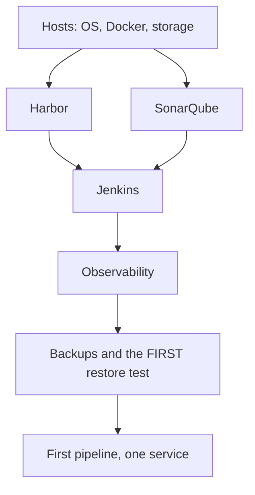

# Platform Installation Strategy

## Purpose

Defines the order in which platform components are installed, what each depends on, and how each is verified before the next is started.

## Scope

Initial installation of the delivery toolchain. Host baseline is in [infrastructure-standard.md](infrastructure-standard.md); per-component operational procedures are in [runbooks/](../../runbooks/).

## Audience

Platform engineers performing the installation.

## Status

**Draft for review.** Nothing has been installed. This is a plan, not a record of what was done.

---

## 1. Principle: Verify Before Proceeding

Each component is verified working before the next is started.

Installing everything and testing at the end produces a failure that could be caused by any of six components and their interactions. Verifying in sequence means each failure has one plausible cause.

The verification for each step below is **functional**, not "the service started". A Harbor whose web interface loads but which cannot serve a pull is not a working registry.

---

## 2. Order, and Why



| Order | Component | Because |
| --- | --- | --- |
| 1 | Hosts | Everything runs on them |
| 2 | **Harbor** | Jenkins publishes to it; installing Jenkins first leaves it with nowhere to publish |
| 3 | SonarQube | Jenkins calls it; the Quality Gate must exist before a pipeline can pass one |
| 4 | Jenkins | Depends on 2 and 3 |
| 5 | Observability | Needed to verify anything that follows actually works |
| 6 | **Backups, and the first restore test** | Before anything of value accumulates |
| 7 | First pipeline, one service | Validates the standards against reality |

Two placements are deliberate and differ from the usual instinct.

**Harbor before Jenkins.** The natural instinct is to install the CI server first because it feels like the centre of the platform. It publishes to a registry that must already exist.

**Backups before the first pipeline.** Backing up an empty platform is quick, and it is the only time the first restore test is cheap — nothing of value is at risk, and the procedure gets exercised before anyone depends on it. Deferring backups until "there is something worth backing up" means the first restore attempt happens when there is something to lose.

---

## 3. Step 1 — Hosts

**Prerequisites:** host inventory, addressing, and firewall rules agreed — `TBD` in [03-network/](../03-network/).

```text
1. Install the OS, minimal, UTC, time sync configured
2. Create the separate /var/lib/docker filesystem
3. Install Docker Engine and the Compose v2 plugin, pinned
4. Apply daemon configuration — including default-address-pools,
   CHECKED against internal addressing, before any network is created
5. Apply the hardening baseline
6. Create the deployment account; configure key-based SSH
7. Configure the host firewall: default deny inbound
```

**Verify:**

- [ ] `docker run --rm hello-world` succeeds
- [ ] `/var/lib/docker` is a separate filesystem
- [ ] Daemon log limits are in effect on a test container
- [ ] Container networks do **not** overlap any internal range in use
- [ ] Clock is synchronized

Step 4 is the one to get right the first time. Changing `default-address-pools` after networks exist means recreating them.

---

## 4. Step 2 — Harbor

**Prerequisites:** storage allocated with a growth forecast; TLS certificate; DNS name.

```text
1. Install Harbor with TLS. Registry credentials cross this connection on
   every push and pull
2. Create the first project
3. Configure tag IMMUTABILITY rules
4. Configure the retention policy — DRY RUN it and review the output
5. Create robot accounts: push for Jenkins, pull-only per environment
6. Set expiry on every robot account
7. Enable vulnerability scanning
8. Configure the scanner database update path — permitted egress or an
   internal mirror
```

**Verify:**

- [ ] Push an image with the Jenkins robot account
- [ ] Pull it with a runtime host's robot account
- [ ] **Attempt a push with a runtime host's credential — it must FAIL**
- [ ] Attempt to overwrite an existing tag — it must fail
- [ ] A scan runs and returns results against a current database

The third and fourth are negative tests and are the point of this step. They confirm the access model and the immutability rule are what was intended rather than what was typed.

`TBD` — Harbor URL, storage backend, TLS certificate management.

---

## 5. Step 3 — SonarQube

**Prerequisites:** database provisioned; JVM heap sized deliberately.

```text
1. Install SonarQube and its database
2. Confirm the EDITION — the Community edition provides no branch or
   pull-request analysis, which changes what the gate evaluates. Settle
   this before designing the gate, not after
3. Create the Quality Gate; assign conditions
4. Create the first project
5. Issue an analysis token, project-scoped where supported
```

**Verify:**

- [ ] An analysis submits successfully
- [ ] The gate evaluates and returns a verdict
- [ ] The token can both submit and read the gate result

The third matters: a token that can submit but not read the gate produces a pipeline that hangs at the Quality Gate rather than failing usefully.

---

## 6. Step 4 — Jenkins

**Prerequisites:** Harbor and SonarQube verified working.

```text
1. Install the controller
2. Install plugins — record the list and versions; plugins run with
   controller privileges
3. Configure agents. TBD — ephemeral or persistent
4. Register credentials: sonarqube-token, harbor-push
5. Restrict administrative access
6. Configure build log retention to match evidence retention, not a
   convenient default
7. Configure the credential store BACKUP, including its master key
```

**Verify:**

- [ ] A job runs on an agent
- [ ] The agent has the required tooling at the required versions
- [ ] A credential is used successfully
- [ ] Jenkins can reach Harbor and SonarQube
- [ ] Build logs are retained as configured

Step 7 is not deferrable to step 6 of the overall sequence. The credential store is encrypted with a master key held separately — **backed up without the key, the restore succeeds and every credential is unusable**, and only a functional restore test detects it.

---

## 7. Step 5 — Observability

**Prerequisites:** hosts and platform components running.

```text
1. Install Prometheus; configure scrape targets including the platform
   components themselves
2. Install Loki and the log collector
3. Install Grafana; provision dashboards as code
4. Load alert rules
5. Configure the alert destination
6. Configure the HEARTBEAT and its EXTERNAL watcher
```

**Verify:**

- [ ] Metrics arrive from every target
- [ ] Logs arrive with the correct labels
- [ ] A dashboard loads against its data sources
- [ ] **An alert actually reaches its destination** — not "the rule evaluates"
- [ ] The heartbeat arrives at the external watcher
- [ ] **Stopping the heartbeat produces an alarm from the watcher**

The last is the only verification that proves detection failure is detectable. Everything else in this step confirms the system works when it works; that one confirms someone finds out when it does not.

Step 6's watcher must be **outside** this stack. A heartbeat evaluated by Prometheus and delivered through the same alerting path proves nothing when the failure is Prometheus or that path.

---

## 8. Step 6 — Backups and the First Restore Test

**Do this before the first pipeline, while the platform is empty.**

```text
1. Configure backups for every component in the backup standard
2. Verify backup jobs run and FAILURE alerts
3. Perform the FIRST RESTORE TEST following sop/restore-test.md
4. Correct the runbooks from what the test finds
5. Repeat with a different person
```

Step 3 is the first execution of the runbooks in [runbooks/](../../runbooks/). Those runbooks have never been run, so **their first execution is itself the first restore test** — and the corrections it produces are the main deliverable.

**Verify:**

- [ ] Each component's backup completes and is readable
- [ ] A restore into an isolated, network-isolated target succeeds
- [ ] A **restored credential** is used successfully
- [ ] Duration measured and recorded
- [ ] Runbooks corrected

---

## 9. Step 7 — First Pipeline

One service, end to end, through the standards.

**Verify:**

- [ ] Commit triggers a build
- [ ] Gates evaluate and can block
- [ ] An image publishes with the correct identity and labels
- [ ] Metrics and logs appear for the deployed service
- [ ] **A deliberate rollback is executed and verified**

The last is the one not to skip. Rollback designed but never executed is an assumption, and this is the cheapest moment to test it.

---

## 10. Blocked by ADR-0009

Deployment to runtime hosts is undecided, so steps 3 and 9 have a gap.

| Option | Additional installation |
| --- | --- |
| A — Jenkins agent on each host | Agent and JVM on every runtime host, including production |
| B — SSH over internal network | SSH keys and network segmentation; no additional software |
| C — Pull-based agent | Agent on each host, **plus a desired-state source as a new platform component** to install and back up |
| D — Portainer API | Nothing beyond Portainer — not recommended |

Option C adds a component to every step of this document: another thing to install, secure, monitor, back up, and recover.

Steps 1 through 8 can proceed today. Only the deployment portion of step 9 is blocked.

---

## 11. Open Items

| Item |
| --- |
| `TBD` — host inventory, addressing, DNS names |
| `TBD` — whether components share hosts |
| `TBD` — TLS certificate management |
| `TBD` — SonarQube edition |
| `TBD` — Jenkins agent model |
| `TBD` — Trivy database update path |
| `TBD` — alert destination and the external heartbeat watcher |
| `TBD` — installation method: manual, Compose, or configuration management |

The last determines whether this is repeatable. A platform installed by hand cannot be rebuilt quickly, and rebuild speed is the mitigation for having no orchestration.

---

## Security Considerations

Two verification steps are negative tests and both are easy to omit: a runtime host credential must **fail** to push, and an existing tag must **fail** to be overwritten. Both confirm a control is real rather than intended, and both are far cheaper to check at installation than to discover later.

Jenkins plugins run with controller privileges. The plugin inventory recorded at step 4 is the input to any later question about what has that level of access.

## Operational Considerations

The ordering choices that matter are Harbor before Jenkins, and backups before anything of value accumulates. The second also produces the first exercise of the runbooks, at the only time when getting it wrong costs nothing.

Installing by hand is faster once and slower every time afterwards. Whether the installation is captured as code determines how the platform is recovered — and with no orchestration, recovery is rebuilding.

---

## Related

- [Infrastructure standard](infrastructure-standard.md)
- [Server sizing guideline](server-sizing-guideline.md)
- [Runbooks](../../runbooks/)
- [Restore test](../../sop/restore-test.md)
- [Backup standard](../11-disaster-recovery/backup-standard.md)
- [ADR-0009](../../adr/0009-deployment-mechanism-to-runtime-hosts.md)
