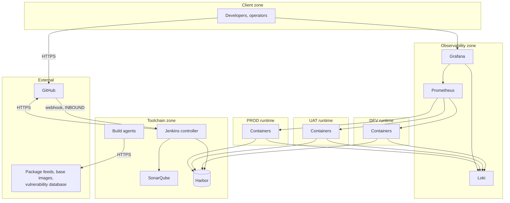

# Network Architecture

## Purpose

Defines the network zones, where each component sits, and which direction traffic flows between them.

## Scope

Zone design and placement. The specific rules are in [firewall-and-port-matrix.md](firewall-and-port-matrix.md); the controls are in [network-security-baseline.md](network-security-baseline.md).

## Audience

Network engineers, platform engineers, and security engineers.

## Status

**Draft for review.** No network exists. Addressing, DNS, and segmentation are undecided.

---

## 1. Zones

| Zone | Contains | Trust |
| --- | --- | --- |
| External | GitHub, package feeds, base image registries, vulnerability database | Untrusted |
| Client | Developer and operator workstations | Semi-trusted |
| Toolchain | Jenkins, agents, SonarQube, Harbor | Controlled |
| Observability | Prometheus, Grafana, Loki | Controlled |
| DEV runtime | Application containers | Controlled, widest access |
| UAT runtime | Application containers | Controlled |
| PROD runtime | Application containers | Controlled, strictest |

`TBD` — whether these are separate network segments, VLANs, subnets, or security groups. The zone model is the requirement; the implementation is an infrastructure decision.

---

## 2. The Property to Preserve

**Only one interaction is inbound to the platform from outside it: the GitHub webhook.**

Everything else is initiated from within the controlled network — Jenkins reaches out to GitHub, SonarQube, and Harbor; runtime hosts pull from Harbor; Prometheus scrapes into the runtimes.

That asymmetry is what makes the firewall design simple, and it is worth defending. Any future requirement that adds an inbound rule deserves scrutiny, because each one is a new externally reachable surface.

`TBD` — whether the webhook is even required. Jenkins can poll GitHub instead, which removes the only inbound path entirely at the cost of latency between push and build. That is a genuine trade worth deciding rather than defaulting.

---

## 3. GitHub Is External

Source control is a SaaS dependency. Three consequences follow that are easy to overlook when drawing the platform as "ours".

| Consequence | |
| --- | --- |
| Outbound HTTPS to GitHub is **required** for every build | A blanket egress block stops delivery |
| The webhook is inbound **from the internet** | It needs authentication and source restriction |
| GitHub availability is a delivery dependency | Its outage stops new builds; existing artifacts still deploy |

---

## 4. Required Outbound Access

A "controlled outbound" policy that does not enumerate these will break builds in ways that look like application failures.

| From | To | For | Consequence if blocked |
| --- | --- | --- | --- |
| Build agents | GitHub | Checkout | No builds |
| Build agents | Package feeds — npm, NuGet | Dependency restore | No builds |
| Build agents | Base image registry | Docker build | No image builds |
| Build agents or Trivy | Vulnerability database | Scanner currency | **Silent failure — see below** |
| Jenkins controller | GitHub | Status reporting | Checks never report |
| Runtime hosts | Harbor | Image pull | No deployment, **no rollback** |

The vulnerability database row is the dangerous one. A blocked update does not fail the scan — it produces a **clean report against a stale database**, indistinguishable from a genuinely clean scan. False assurance is acted upon.

`TBD` — whether these are permitted egress or served by internal mirrors. An internal mirror for package feeds and the vulnerability database removes the external dependency and adds components to operate.

---

## 5. Environment Isolation

The runtime zones must not reach each other.

| Rule | Reason |
| --- | --- |
| DEV cannot reach UAT or PROD | DEV has the widest access and the weakest controls, which makes it the natural pivot |
| UAT cannot reach PROD | Same, one step up |
| No environment reaches another's database or services | Environment separation is a boundary, not a convention |

This is the network expression of the secret boundary. Distinct credentials per environment prevent a compromise from *authenticating*; network isolation prevents it from *reaching*. Both are needed, because either alone fails to a mistake in the other.

---

## 6. Within a Runtime Host

Container-level segmentation, from [docker-compose-standard.md](../06-container/docker-compose-standard.md).

| Network | Contains | Note |
| --- | --- | --- |
| `frontend` | Web-facing containers | Reachable through a reverse proxy |
| `backend` | Application and data containers | **`internal: true`** — no route out |

`internal: true` costs one line and removes outbound reachability from the components most worth isolating. A container that cannot reach the internet cannot exfiltrate to it.

### Docker manipulates the packet filter directly

Docker inserts its own rules, and they are commonly evaluated **before** the host firewall's. A published port can therefore be reachable on a host that appears firewalled.

Two mitigations, both required:

- Bind published ports to a specific address: `127.0.0.1:8080:8080`, never `8080:8080`
- Verify actual reachability from outside the host after any change, rather than reading the firewall configuration

`TBD` — confirm the interaction between Docker and the chosen host firewall, by testing rather than by assumption.

---

## 7. Administrative Interfaces

| Interface | Exposure |
| --- | --- |
| Jenkins web | Internal only |
| Harbor web | Internal only |
| SonarQube web | Internal only |
| Grafana | Internal only; `TBD` — whether developers reach it directly |
| **Portainer** | Internal only, and restricted further per environment |
| Host SSH | Internal only, restricted source |

**No administrative interface is publicly exposed** without explicit justification and compensating controls.

Portainer deserves the extra restriction because its modification capability is what would turn it into an ungoverned deployment path — see [access-control.md](../07-security/access-control.md).

---

## 8. TLS

| Connection | TLS |
| --- | --- |
| Anything crossing a zone boundary | Required |
| Registry push and pull | **Required** — credentials cross on every operation |
| Analysis submission | Required — the token crosses |
| Web interfaces | Required |
| Prometheus scraping | `TBD` |
| Log shipping | `TBD` |
| Within a host, container to container | Not required if the network is `internal` |

`TBD` — certificate management: internal certificate authority, or an external issuer. Whichever is chosen, **expiry monitoring is required** — a certificate expiry is a predictable, preventable outage, and it is on the alert list for that reason.

---

## 9. Blocked: One Flow Is Undecided

**How the pipeline reaches runtime hosts is undecided**, and the option chosen determines the direction of that connection — which is the property that determines the firewall rule.

| Option | Direction | Inbound to runtime hosts |
| --- | --- | --- |
| A — Jenkins agent on host | Host → controller | **None** |
| B — SSH over internal network | Controller → host | SSH, from the toolchain zone only |
| C — Pull-based agent | Host → desired-state source | **None** |
| D — Portainer API | Controller → host | Portainer API |

Options A and C preserve the property in section 2: no inbound access to runtime hosts at all.

Everything else in this document is independent of the decision. See [ADR-0009](../../adr/0009-deployment-mechanism-to-runtime-hosts.md).

---

## 10. Open Items

| Item |
| --- |
| `TBD` — segmentation implementation: VLANs, subnets, or security groups |
| `TBD` — addressing plan, checked against Docker's `default-address-pools` |
| `TBD` — internal DNS names |
| `TBD` — whether the GitHub webhook is used, or Jenkins polls |
| `TBD` — permitted egress versus internal mirrors |
| `TBD` — certificate management and expiry monitoring |
| `TBD` — whether Prometheus scraping and log shipping use TLS |
| `TBD` — **deployment mechanism** ([ADR-0009](../../adr/0009-deployment-mechanism-to-runtime-hosts.md)) |

The addressing item interacts with [infrastructure-standard.md](../02-infrastructure/infrastructure-standard.md#4-docker-engine): Docker's default bridge range can collide with an internal range, and the resulting failure looks like a firewall problem. Settle both together, before any network is created.

---

## Security Considerations

The single inbound interaction in section 2 is the property this design is built around. Its value is that the platform's external attack surface is one authenticated webhook endpoint — and it is preserved only if new inbound rules are resisted.

Environment isolation and the secret boundary are the same control seen from two angles. Distinct credentials stop authentication; network isolation stops reachability. Relying on only one means a single mistake removes the separation entirely.

Docker's packet-filter behaviour is the most likely cause of an unintended exposure here, because the host firewall configuration will look correct.

## Operational Considerations

Section 4 is the section that prevents a class of confusing incident. Egress restrictions applied without enumerating the platform's real outbound needs break builds in ways that present as application or tooling failures, and the diagnosis is slow because nothing points at the network.

The vulnerability database case is worse than a break: it degrades silently into false assurance rather than failing.

---

## Related

- [Firewall and port matrix](firewall-and-port-matrix.md)
- [Network security baseline](network-security-baseline.md)
- [Service interaction](../01-architecture/service-interaction.md)
- [Infrastructure standard](../02-infrastructure/infrastructure-standard.md)
- [Docker Compose standard](../06-container/docker-compose-standard.md)
