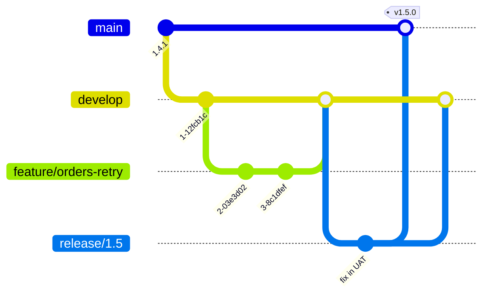

# Branching Strategy

## Purpose

Defines the branch model, branch naming, lifecycle, and the hotfix path.

## Scope

Branching for application repositories. How a branch maps to an environment is in [environment-architecture.md](../01-architecture/environment-architecture.md); merge mechanics are in [pull-request-standard.md](pull-request-standard.md).

## Audience

All developers.

## Status

**Draft for review.** The model is fixed by policy; branch naming and merge-back enforcement are undecided.

---

## 1. The Model

```text
feature/*  ->  develop  ->  DEV
release/*  ->              UAT
main       ->              PROD
```

| Branch | Lifetime | Protected | Deploys to |
| --- | --- | --- | --- |
| `main` | Permanent | Yes | PROD |
| `develop` | Permanent | Yes | DEV |
| `release/*` | Weeks at most | Yes | UAT |
| `feature/*` | Days | No | Nothing |
| `hotfix/*` | Hours | Yes | PROD, via the hotfix path |



Note the last step. Fixes made on a release branch are merged **back to `develop`**, not only forward to `main`. Section 5 explains why this is the model's most consequential failure point.

---

## 2. Branch Naming

`TBD` — confirm. Proposal:

```text
feature/<ticket>-<short-description>     feature/TBD-1234-order-retry
bugfix/<ticket>-<short-description>      bugfix/TBD-1290-null-customer
hotfix/<version>-<short-description>     hotfix/1.4.2-payment-timeout
release/<version>                        release/1.5
```

Lowercase, hyphenated, no personal names. A branch named after a person tells you who, which Git already records, and not what — which is what a reviewer scanning a branch list needs.

---

## 3. Feature Branches

Branch from `develop`. Merge back to `develop` through a pull request.

| Rule | Reason |
| --- | --- |
| Short-lived — days, not weeks | Divergence cost grows non-linearly with age |
| One logical change | Reviewable |
| Rebase or merge from `develop` before review | The reviewer sees the change against current state |
| Deleted after merge | A branch list that reflects work in progress is useful; one full of merged branches is not |

Long-lived feature branches are the model's most common self-inflicted problem. A branch open for six weeks accumulates conflicts against every change merged in the meantime, and resolving those conflicts is unreviewed work performed under pressure to finish. The conflict resolution is where defects enter, and it is the part nobody reviews carefully.

Where a change is genuinely too large to complete in days, split it — behind a feature flag if necessary — rather than holding the branch open.

---

## 4. Release Branches

Branch from `develop` when a set of changes is ready for acceptance. Deploy to UAT from this branch.

| Rule | Reason |
| --- | --- |
| Only stabilization commits after cutting | A release branch is for fixing what UAT finds, not for adding scope |
| No new features | Adding features restarts verification |
| Merge to `main` when accepted | `main` reflects what is in production |
| **Merge back to `develop`** | Otherwise fixes are lost — see section 5 |
| Tag on `main` at the merge | See [release-and-tagging-standard.md](release-and-tagging-standard.md) |
| Delete after both merges complete | |

Scope added to a release branch after cutting invalidates whatever UAT verification has already been done. The mechanism for "this needs to go out too" is the next release, not the current branch.

`TBD` — whether release branches are cut on a schedule or on demand.

---

## 5. Merging Back Is Where This Model Fails

The model has two permanent branches and two temporary ones that merge into both. **A fix that reaches `main` without also reaching `develop` is silently reverted by the next release.**

The sequence:

```text
1. release/1.5 is in UAT
2. A defect is found; it is fixed on release/1.5
3. release/1.5 merges to main, is tagged, and deploys to production
4. The merge back to develop is forgotten
5. develop still contains the defect
6. release/1.6 is cut from develop
7. The defect returns to production, in a release nobody associated with it
```

This is the most common serious failure of this branch model, and it has three properties that make it worse than an ordinary bug: it reintroduces a defect that was already fixed, the fix's author believes it is resolved, and the reappearance is separated from the cause by a full release cycle.

The same applies to every hotfix.

Mitigations, in order of reliability:

| Mitigation | Strength |
| --- | --- |
| Automated check that no commit on `main` is absent from `develop` | Detects it regardless of discipline |
| Merge-back as a required step in the release checklist | Depends on the checklist being followed |
| Convention | Fails eventually |

`TBD` — whether the automated check is implemented. It is the single highest-value automation in this document, and it is cheap: comparing `main` and `develop` for commits present in one and not the other is a scheduled job, not a project.

---

## 6. Hotfix

For a production defect that cannot wait for the next release.

```text
1. Branch hotfix/<version> from main — not from develop
2. Make the minimal fix
3. Pull request, with expedited review — reviewed, not skipped
4. Merge to main
5. Tag the patch version
6. Build, then promote through DEV and UAT verification where time allows
7. Deploy to production with approval
8. MERGE BACK TO develop
9. Delete the branch
```

Branching from `main` rather than `develop` is the point of a hotfix. `develop` contains unreleased work; branching from it would carry that work into production alongside the fix, which is how an urgent one-line change becomes an unplanned release.

Steps 3 and 6 are the ones abandoned under pressure. Both are reducible, neither is removable: expedited review is still review, and a hotfix that skips verification entirely is a change deployed to production having been run nowhere.

`TBD` — the hotfix approval path, and what verification is mandatory even under time pressure. See [10-governance/](../10-governance/).

---

## 7. What Builds and What Deploys

| Branch | Pipeline runs | Image published | Deployable to |
| --- | --- | --- | --- |
| `feature/*` | Build, test, analysis | `TBD` — see below | Nothing |
| `develop` | Full pipeline | Yes, `sha-<commit>` | DEV |
| `release/*` | Full pipeline | Yes, `<version>-<commit>` | DEV, UAT, PROD |
| `main` | Full pipeline | Yes, `<version>-<commit>` | PROD |
| `hotfix/*` | Full pipeline | Yes, `<version>-<commit>` | PROD, via the hotfix path |

Promotable images are built only from protected branches. A commit on a feature branch may never exist in that form on `develop` — squash merging guarantees it will not — so an image tagged with a feature-branch commit references a commit that is not in the branch history it claims to come from.

`TBD` — whether feature branches publish an image at all. Publishing one gives developers something to test with; not publishing avoids filling the registry with images that will never be promoted.

---

## 8. Honest Assessment of This Model

`AGENTS.md` fixes this model, and it is a reasonable fit for scheduled releases with a manual approval gate and a UAT verification stage. It is also the more complex of the common options, and its costs should be understood by the people paying them:

| Cost | Consequence |
| --- | --- |
| Two permanent branches | Every fix on one must reach the other; see section 5 |
| Release branches | A window in which three branches hold different code |
| Merge-back obligation | The model's principal failure mode, and it is silent |
| Long-lived branches invited by the structure | Conflict resolution as unreviewed work |

The alternative — trunk-based development with feature flags — removes the merge-back problem entirely by having one permanent branch. It requires feature flags, a strong automated test suite, and comfort with unreleased code in production paths. Those are prerequisites, not preferences, and the current platform does not have them.

The model is therefore correct for now. Revisit it if merge-back failures occur, or if release cadence increases to the point where release branches are open continuously. That would be an ADR — see [adr/](../../adr/).

---

## 9. Open Items

| Item | Affects |
| --- | --- |
| `TBD` — branch naming convention | Consistency |
| `TBD` — automated merge-back verification | The model's principal failure mode |
| `TBD` — release cadence: scheduled or on demand | Release branch lifetime |
| `TBD` — hotfix approval path and minimum verification | Emergency change safety |
| `TBD` — whether feature branches publish images | Registry volume |
| `TBD` — maximum feature branch age, and whether it is enforced | Conflict cost |

---

## Security Considerations

The branch model implements the review boundary: nothing reaches a protected branch without review, and nothing reaches production without passing through `main`. That property depends entirely on branch protection being configured and not bypassed — see [git-standard.md](git-standard.md#7-branch-protection).

The hotfix path is where the boundary is under most pressure, because urgency is the standing argument for skipping review. Expedited review is the mitigation; skipped review is not a faster version of it.

## Operational Considerations

Section 5 is the operational risk in this document. Merge-back depends on discipline at the least disciplined moment — immediately after a release, when attention moves elsewhere. Automating the check converts a recurring silent defect into a visible one.

Long-lived feature branches are the second cost, and it accrues invisibly: the branch looks like progress while the conflict debt grows.

---

## Related

- [Git standard](git-standard.md)
- [Pull request standard](pull-request-standard.md)
- [Release and tagging standard](release-and-tagging-standard.md)
- [Environment architecture](../01-architecture/environment-architecture.md)
- [CI/CD standards](../05-ci-cd/)
