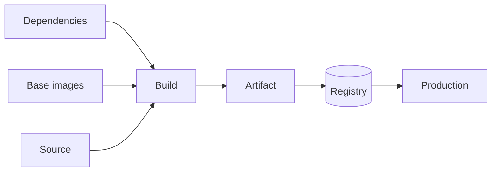

# Software Supply-Chain Security

## Purpose

Defines controls protecting the path from source code to running production artifact against tampering and untrusted inputs.

## Scope

Build integrity, dependency trust, base image trust, CI credential isolation, and provenance. Vulnerability handling is in [vulnerability-management.md](vulnerability-management.md); component inventory is in [sbom-standard.md](sbom-standard.md); artifact origin verification is in [container-image-signing.md](container-image-signing.md).

## Audience

Security engineers, platform engineers, and architects.

## Status

**Draft for review.** Several controls are not adopted at this stage; each says so explicitly.

---

## 1. The Problem

Vulnerability scanning answers "does this artifact contain a known-bad component?" Supply-chain security answers a different question: "is this artifact what we think it is?"

Scanning cannot detect a deliberately introduced backdoor, a substituted dependency, or a compromised build. Those are not known vulnerabilities; they are trusted inputs that were not trustworthy.

The delivery path has several points where an artifact can be influenced:



Each input is a trust decision, and each is a place where a control belongs.

---

## 2. Trust Points

| Point | Threat | Control | Status |
| --- | --- | --- | --- |
| Source | Unreviewed change merged | Branch protection, required review | `TBD` — configuration |
| Source | Commit attributed to someone who did not make it | Signed commits | Not adopted |
| Dependencies | Substituted, typosquatted, or compromised package | Lockfiles, pinning, trusted feeds | Not implemented |
| Base images | Compromised or unpatched base | Approved source, digest pinning | Not implemented |
| Build | Build environment tampered with | Ephemeral agents, isolated credentials | `TBD` |
| Build | Credentials extracted from the build | Credential isolation, no secrets in `ARG` | Policy only |
| Artifact | Substituted in the registry | Registry access control, tag immutability | Not implemented |
| Artifact | Origin unverifiable at the deployment target | Image signing and verification | Not adopted, Phase 3 |
| Deployment | Something deployed that never passed the pipeline | Deployment audit trail, change control | Not implemented |

The artifact substitution row is the most consequential in this architecture. An attacker able to replace an image in Harbor gets arbitrary code into production through an entirely legitimate deployment, which passes health checks and produces an accurate audit record naming a real approver. Nothing downstream detects it.

Registry access control and tag immutability are the current defenses. Signing is the control that would make the guarantee independent of the registry — see [container-image-signing.md](container-image-signing.md).

---

## 3. Dependency Trust

### Lockfiles are authoritative

Builds resolve dependencies from a committed lockfile, not from a version range.

```bash
npm ci          # installs exactly the lockfile; fails if it disagrees with package.json
npm install     # may resolve differently and rewrite the lockfile
```

For .NET, use a committed `packages.lock.json` with locked-mode restore. Without it, a build resolves the newest version satisfying each range — so the same commit produces different dependency sets on different days, and "what is in this artifact" has no fixed answer.

### Feed trust

`TBD` — whether an internal package proxy is used. A proxy provides three properties worth having: a record of what was pulled, protection against a package being removed upstream, and a place to enforce policy.

It also introduces a dependency-confusion consideration: where a proxy serves both internal and public packages, an internal package name registered publicly can be resolved from the wrong source. If a proxy is adopted, internal namespaces must be configured to resolve only internally.

### Update discipline

Pinning without an update process converts a reproducibility benefit into a patching problem. Dependencies pinned and never updated accumulate known vulnerabilities silently, and pinning is what makes the accumulation invisible.

`TBD` — dependency update cadence and whether automated update proposals are used.

---

## 4. Base Image Trust

Base images are the largest untrusted input by volume. A typical application image is mostly base layers.

| Requirement | Detail | Status |
| --- | --- | --- |
| Approved source | A defined registry, not arbitrary public images | `TBD` |
| Pinning | Version tag at minimum; digest for production | `TBD` |
| Update cadence | Defined, and executed | `TBD` |
| Minimal surface | Runtime-specific images over general distributions | Required |

Digest pinning gives byte-level reproducibility. It also means security patches require an explicit update — which is correct, provided the update process exists. Adopting digest pinning without one trades a reproducibility problem for a patching one, and the second is harder to notice.

See [dockerfile-standard.md](../06-container/dockerfile-standard.md#2-base-image-policy).

---

## 5. Build Environment Integrity

The build environment is where source, dependencies, and credentials are simultaneously present. It is consequently the highest-value target in the pipeline.

| Control | Purpose | Status |
| --- | --- | --- |
| Ephemeral build agents | A compromise does not persist to the next build | `TBD` |
| Credentials scoped per job | A compromised build cannot reach unrelated systems | `TBD` |
| No secrets in build arguments or logs | Prevents extraction from artifacts and logs | Policy only |
| Workspace cleaned between builds | Prevents artifacts leaking between jobs | `TBD` |
| Pipeline definition in source control | Pipeline changes are reviewed like code | Required |
| Restricted controller access | The controller holds every environment's credentials | `TBD` |

Ephemeral agents matter more than they appear to. A persistent agent that is compromised once affects every subsequent build on it, including builds for applications unrelated to the one that introduced the compromise.

`TBD` — whether the Jenkins agent model supports ephemeral agents, in [05-ci-cd/](../05-ci-cd/).

---

## 6. Provenance

Provenance is the record of how an artifact was produced: from which commit, by which pipeline execution, using which inputs.

Currently available:

| Element | Mechanism | Status |
| --- | --- | --- |
| Source commit | OCI label on the image | Defined, not implemented |
| Build metadata | OCI labels: version, created, source | Defined, not implemented |
| Component inventory | SBOM | Not implemented |
| Cryptographic attestation | Signing | Not adopted |

The first three are self-reported: an image claims which commit produced it, and nothing verifies the claim. That is useful for operations and useless against an adversary. Signing is what makes provenance verifiable rather than asserted.

Formal provenance frameworks such as SLSA describe levels of build integrity. This blueprint is `aligned with` their direction — reproducible inputs, isolated builds, verifiable artifacts — and claims **no** level of conformance. No assessment has been performed.

---

## 7. Adoption Order

Controls in the order that yields the most benefit per unit of effort:

| Order | Control | Why here |
| --- | --- | --- |
| 1 | Lockfiles and dependency pinning | Cheap; makes builds reproducible, which everything else assumes |
| 2 | Base image pinning with an update process | Removes the largest silent input |
| 3 | Registry access control and tag immutability | Closes artifact substitution at low cost |
| 4 | Credential isolation per job | Limits blast radius of a compromised build |
| 5 | SBOM generation and retention | Enables response to disclosures |
| 6 | Ephemeral build agents | Limits persistence of a compromise |
| 7 | Image signing and verification | Makes provenance verifiable |

Signing is last because it depends on the preceding controls being real. Signing an artifact built from unpinned dependencies in a persistent, credential-rich environment produces a verifiable signature over something whose contents were never controlled — a cryptographic guarantee about an uncontrolled input.

---

## 8. Open Items

| Item | Affects |
| --- | --- |
| `TBD` — internal package proxy, and dependency confusion protection if adopted | Dependency trust |
| `TBD` — dependency update cadence and tooling | Patch currency |
| `TBD` — approved base image registry and update process | Base image trust |
| `TBD` — ephemeral versus persistent build agents | Build integrity |
| `TBD` — credential scoping model per Jenkins job | Blast radius |
| `TBD` — whether signed commits are required later | Source attribution |

---

## Security Considerations

Two properties of this architecture shape everything above.

Jenkins holds credentials for every environment and is authorized to publish artifacts and change production. Its compromise is not detectable by any downstream control, because everything it produces afterwards is legitimate.

Harbor holds the only copy of every deployable artifact. Its compromise is likewise invisible to deployment controls.

Both are correct choices at this scale, and both mean the platform's supply-chain security is largely a question of how well those two systems are protected — not how thoroughly artifacts are scanned.

## Operational Considerations

Every control here has recurring cost: dependency updates, base image updates, credential rotation, and SBOM retention. Controls with recurring cost and no immediate consequence for skipping them are the ones that lapse.

Pinning without updating is the specific failure worth guarding against, because it looks like the secure state. An artifact pinned to a digest and never updated is reproducible, auditable, and progressively more vulnerable.

---

## Related

- [Security baseline](security-baseline.md)
- [Vulnerability management](vulnerability-management.md)
- [SBOM standard](sbom-standard.md)
- [Container image signing](container-image-signing.md)
- [Dockerfile standard](../06-container/dockerfile-standard.md)
- [Harbor standard](../06-container/harbor-standard.md)
