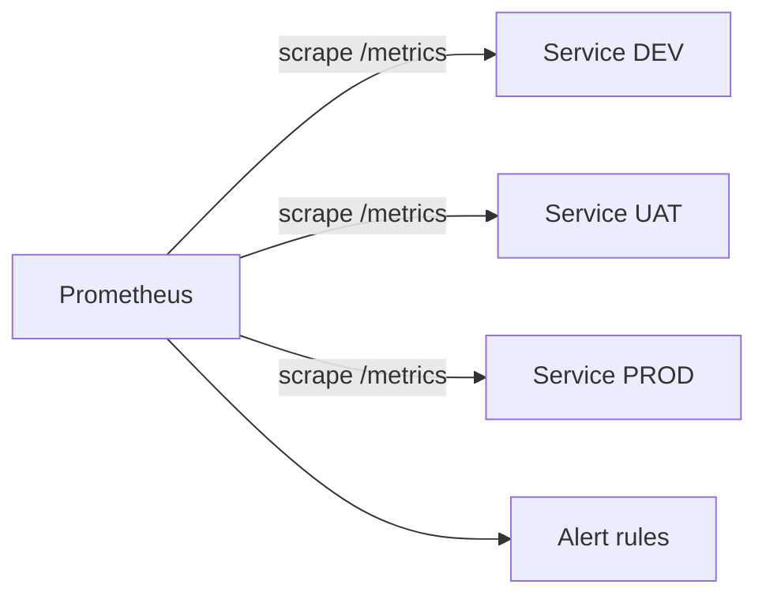

# Monitoring Standard

## Purpose

Defines how metrics are exposed, collected, named, labelled, and retained.

## Scope

Prometheus collection and metric conventions. What a service must expose is in [observability-standard.md](observability-standard.md); alert rules are in [alerting-standard.md](alerting-standard.md).

## Audience

Developers instrumenting services, and platform engineers operating Prometheus.

## Status

**Draft for review.** Not implemented. Retention, scrape interval, and thresholds are undecided.

---

## 1. Collection Model

Prometheus **scrapes**; services do not push.



Consequences worth stating explicitly:

- Monitoring initiates the connection into the runtime. That is an access decision — see interaction I-08 in [service-interaction.md](../01-architecture/service-interaction.md#1-interaction-catalogue) — not an implementation detail.
- A service that is not reachable produces no metrics, and the absence is itself detectable. This is a feature: scrape failure is a signal.
- Short-lived jobs that exit between scrapes are not observable this way. `TBD` — whether a push gateway is needed for any workload.

`TBD` — scrape interval. Shorter intervals detect faster and cost proportionally more storage. 15 to 30 seconds is a common starting range.

---

## 2. Exposition

Services expose metrics on an HTTP endpoint in Prometheus text format.

`TBD` — the standard path and port. Proposal: `/metrics`, on the application port.

A separate port is worth considering. It allows the metrics endpoint to be restricted at the network level without affecting application traffic, which matters because the endpoint reveals internal structure — route names, dependency names, queue names — to anyone who can reach it.

`TBD` — whether metrics are exposed on a separate port, and how access is restricted.

---

## 3. Naming

Follow Prometheus conventions. Consistency matters more than any individual choice, because dashboards and alert rules are written against names, and a name that differs between services requires every rule to be written twice.

```text
<namespace>_<subsystem>_<name>_<unit>
```

| Rule | Example |
| --- | --- |
| Base units — seconds, not milliseconds; bytes, not megabytes | `http_request_duration_seconds` |
| Counters end in `_total` | `http_requests_total` |
| Suffix states the unit | `process_resident_memory_bytes` |
| Lowercase with underscores | `queue_backlog_items` |
| No units in labels | Use `_seconds` in the name, not `unit="s"` |

Base units are a Prometheus convention that is tedious once and correct thereafter. Mixed units across services make dashboard expressions wrong in ways that look right.

---

## 4. Metric Types

| Type | Use for | Do not use for |
| --- | --- | --- |
| Counter | Values that only increase: requests, errors, items processed | Anything that can decrease |
| Gauge | Values that go up and down: queue depth, memory, connections | Counting events |
| Histogram | Distributions: latency, payload size | Values needing exact percentiles across many series |
| Summary | Distributions where client-side quantiles are acceptable | Values needing aggregation across instances |

Counters reset to zero when a process restarts. Query them with `rate()` or `increase()`, which handle resets. A dashboard showing a raw counter shows a sawtooth on every deployment and is almost always a mistake.

Prefer histograms over summaries. Summary quantiles are computed per instance and **cannot be aggregated** — averaging three instances' 95th percentiles does not produce the 95th percentile. Histograms aggregate correctly.

`TBD` — standard histogram buckets per application type. Default buckets are rarely right for a specific service; buckets that all fall above or below the actual latency range produce a histogram that measures nothing.

---

## 5. Labels and Cardinality

This is the section that determines whether the monitoring system survives contact with production.

### Required labels

Every metric carries:

| Label | Value |
| --- | --- |
| `service` | Service name |
| `environment` | `dev`, `uat`, or `prod` |
| `version` | Release version |
| `instance` | Set by Prometheus at scrape time |

`version` is what allows "did the error rate change when we deployed?" to be answered from the metric itself.

### Cardinality

Every distinct combination of label values creates a separate time series. Series count is the primary driver of Prometheus memory and storage use, and it multiplies:

```text
10 services × 3 environments × 5 versions × 20 routes = 3,000 series
```

That is fine. This is not:

```text
... × 50,000 distinct user IDs = 150,000,000 series
```

**Never use as a label:** user identifiers, request or correlation identifiers, session identifiers, full URLs with parameters, email addresses, IP addresses, timestamps, or any value derived from user input.

The last is the general rule, and it is the one that catches the unanticipated cases. A label whose values come from user input is a label an outsider controls the cardinality of.

High-cardinality data belongs in logs, where it is a field rather than an index. That is the division of labour between the two systems: metrics answer "how many, how fast, how often" cheaply at any cardinality of *questions*; logs answer "what exactly happened to this one request".

### Route labels

Use the route template, never the resolved path:

```text
route="/api/orders/{id}"      bounded — one series per route
route="/api/orders/84213"     unbounded — one series per order ever requested
```

The second is the most common way a Prometheus instance is destroyed by a well-intentioned change.

`TBD` — a series-count limit per service, and whether it is enforced.

---

## 6. What Is Monitored

| Layer | Source | Metrics |
| --- | --- | --- |
| Application | Service `/metrics` | Request rate, errors, latency, business signals |
| Runtime | Application `/metrics` | Heap, GC, thread pool, connections |
| Container | Container metrics exporter | CPU, memory, restart count, throttling |
| Host | Node exporter | CPU, memory, disk, network, filesystem |
| Platform | Jenkins, Harbor, SonarQube | Availability, queue depth, storage |

Host disk usage is not optional. A full disk on a runtime host stops every container on it, and the two common causes — unrotated container logs and accumulated images — both grow predictably enough to alert on long before they matter. See [docker-compose-standard.md](../06-container/docker-compose-standard.md#7-logging-and-disk).

Platform monitoring is easy to omit because the platform is what does the monitoring. Harbor unavailable stops deployment **and rollback**; that condition must alert.

`TBD` — the container and host exporter selection.

---

## 7. Recording Rules

Precompute expensive or frequently used expressions.

```text
job:http_request_error_rate:ratio5m
```

Recording rules serve two purposes: dashboards load faster, and alert rules and dashboards share one definition of a derived value. Where an alert and a dashboard compute error rate differently, the dashboard will eventually disagree with the alert, and the disagreement is discovered while someone is trying to decide whether the alert is real.

`TBD` — the recording rule set.

---

## 8. Retention

| Environment | Proposed retention |
| --- | --- |
| DEV | `TBD` — short |
| UAT | `TBD` — medium |
| PROD | `TBD` — longest |

Retention should be driven by the questions that need answering: incident review needs weeks; capacity trending needs months; year-over-year comparison needs longer than raw metrics are usually kept.

Retention is bounded by storage, and storage is a function of series count and scrape interval. All three must be decided together — deciding retention alone produces a number that is either unaffordable or insufficient.

`TBD` — retention per environment, storage allocation, and whether downsampled long-term storage is needed.

---

## 9. Federation and Scale

A single Prometheus instance is appropriate at this scale and is a single point of failure for detection. If it is unavailable, no alert fires — and the absence of alerts is indistinguishable from health.

`TBD` — whether Prometheus availability is monitored externally, and by what. Something outside Prometheus must be able to detect that Prometheus has stopped. See [alerting-standard.md](alerting-standard.md).

---

## 10. Open Items

| Item | Affects |
| --- | --- |
| `TBD` — scrape interval | Detection speed, storage |
| `TBD` — metrics path, port, and access restriction | Exposure |
| `TBD` — histogram buckets per application type | Whether latency data is meaningful |
| `TBD` — series-count limits and enforcement | Prometheus stability |
| `TBD` — container and host exporters | Infrastructure visibility |
| `TBD` — recording rule set | Dashboard and alert consistency |
| `TBD` — retention per environment and storage allocation | Cost, incident review capability |
| `TBD` — external monitoring of Prometheus itself | Detection reliability |
| `TBD` — whether a push gateway is needed | Short-lived job visibility |

---

## Security Considerations

A metrics endpoint is a structural description of the service: its routes, its dependencies, its queues, and its traffic patterns. It is useful reconnaissance and is usually unauthenticated. Restrict it by network position at minimum, and consider a separate port so the restriction does not affect application traffic.

Metric labels must never carry personal data. Metrics are retained longer than logs in most designs and are not subject to the same redaction attention, so a label containing an identifier persists quietly for the whole retention period.

## Operational Considerations

Cardinality is the failure mode to design against. It does not degrade gradually — a single change that labels a metric with an unbounded value can exhaust memory on the Prometheus host and take monitoring down entirely, which means the platform loses detection at the moment it acquires a problem.

The mitigations are conventions, review of new metrics, and a series-count limit that alerts before the limit is reached rather than at it.

---

## Related

- [Observability standard](observability-standard.md)
- [Alerting standard](alerting-standard.md)
- [Dashboard standard](dashboard-standard.md)
- [Monitoring templates](../../templates/monitoring/)
- [Service interaction](../01-architecture/service-interaction.md)
