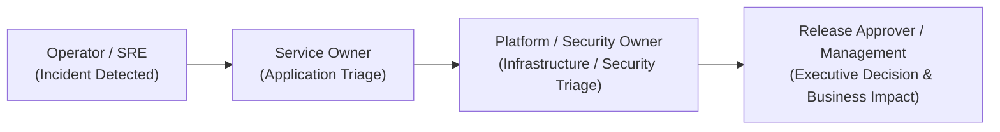

# Enterprise DevOps Governance RACI Matrix

## Purpose

Defines the organizational **RACI Matrix** (Responsible, Accountable, Consulted, Informed) to operationalize decision rights, approval gates, and lifecycle ownership across the Enterprise DevOps Platform.

This document unblocks the organizational role assignments identified in [devops-governance.md](devops-governance.md) and [devops-roadmap.md](../00-executive/devops-roadmap.md).

---

## 1. Stakeholder Roles & Organizational Mapping

| Blueprint Role | Organizational Function | Core Mandate |
| --- | --- | --- |
| **Platform Owner** | **Platform Engineering Team** | Operates toolchain (Jenkins, Harbor, SonarQube, Portainer, Observability), maintains shared templates and infrastructure. |
| **Service Owner** | **Application Development Teams** | Owns service source code, automated unit/integration tests, Dockerfile runtime, and application configuration. |
| **Security Owner** | **Information Security (SecOps / CISO)** | Owns security baselines, vulnerability policies, SBOM audits, image signing, and security exception approvals. |
| **Release Approver** | **Release Management / Product Owner** | Accountable for production delivery authorization, change verification, and business impact assessment. |
| **Operator / SRE** | **Operations & Reliability Engineering** | Host provisioning, infrastructure monitoring, backup validation, and incident escalation response. |

---

## 2. Core Governance RACI Matrix

- **R (Responsible)**: The role that conducts the actual work or authors the change.
- **A (Accountable)**: The single role with final decision and approval authority. Exactly **one** role is Accountable per activity.
- **C (Consulted)**: Subject-matter experts who must provide input before a decision or action.
- **I (Informed)**: Stakeholders who are kept updated on progress, results, or completion.

| Activity / Decision Area | Platform Team | Service Team | Security Team | Release Mgr | Ops / SRE | Primary Evidence |
| :--- | :---: | :---: | :---: | :---: | :---: | :--- |
| **Adopt or Replace Toolchain Component** | **A / R** | C | C | I | C | [Architecture Decision Record (ADR)](../../adr/) |
| **Modify Platform Engineering Standard** | **A / R** | C | C | I | I | Pull Request in Blueprint Repository |
| **Enforce Branch Protection & CI Gates** | **R** | I | **A** | I | I | GitHub Branch Settings / Audit Log |
| **Production Release Deployment Gate** | I | C | C | **A** | R | Jenkins Deployment Record & Git Tag |
| **Emergency Hotfix / Break-Glass Deploy** | C | R | C | **A** | R | Emergency Change Ticket & Audit Record |
| **Security Vulnerability Exception (.trivyignore)** | C | R | **A** | I | I | Exception Register & Expiry Date |
| **Scheduled Credential Rotation** | **R** | C | **A** | I | C | Rotation Audit Log ([SOP](../../sop/credential-rotation.md)) |
| **Disaster Recovery Restore Testing** | **A / R** | I | C | I | R | Restore Evidence Record ([SOP](../../sop/restore-test.md)) |
| **Production Host SSH / Admin Access Grant** | C | I | **A** | I | R | Access Approval Ticket ([Policy](production-access-policy.md)) |
| **UAT Environment Parity Maintenance** | R | **A** | I | C | C | Environment Audit Report |
| **Observability Alert Triage & Response** | C | **A / R** | I | I | C | Incident Post-Mortem & Alert Log |

---

## 3. Separation of Duties Enforcements

To satisfy [AGENTS.md](../../AGENTS.md) Section 3 and [devops-governance.md](devops-governance.md) Section 4, the following role separations are technically and procedurally enforced:

1. **Release Author ≠ Release Approver**:
   - The developer who authored or merged code into `release/*` cannot serve as the sole Release Approver for production deployment.
   - Enforced by Jenkins Pipeline `input` step and GitHub PR review requirements.
2. **Exception Requester ≠ Exception Approver**:
   - Development teams cannot approve their own Trivy vulnerability waivers or Quality Gate bypasses.
   - All waivers require formal sign-off by the Security Owner.
3. **Access Requester ≠ Access Grantor**:
   - Privileged administrative access to production hosts or Portainer environments requires sign-off from the Security Owner and is provisioned through short-lived access records.

---

## 4. Operational Escalation Path

- **Severity 1 (Platform Outage / Security Breach)**:
  - Acknowledgment: ≤ 15 minutes
  - Incident Lead: Operations / SRE
  - Escalation: Directly to Platform Owner and Security Owner
- **Severity 2 (Degraded Pipeline / Non-Prod Outage)**:
  - Acknowledgment: ≤ 1 hour
  - Incident Lead: Platform Engineering Team
  - Escalation: Service Owner

---

## Related Documents

- [DevOps Governance](devops-governance.md)
- [Change Management](change-management.md)
- [Production Access Policy](production-access-policy.md)
- [Exception Management](exception-management.md)
- [Audit Evidence](audit-evidence.md)
- [SOP — Credential Rotation](../../sop/credential-rotation.md)
- [SOP — Restore Test](../../sop/restore-test.md)
