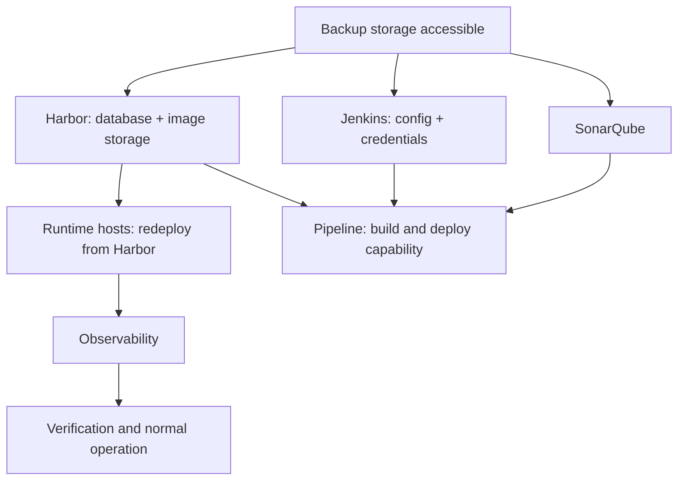

# Disaster Recovery Plan

## Purpose

Defines the failure scenarios the platform must survive, the response to each, and the order in which capability is restored.

## Scope

Recovery of the delivery platform and application runtimes. What is captured is in [backup-standard.md](backup-standard.md); proving recovery works is in [restore-testing.md](restore-testing.md).

## Audience

Platform engineers, operators, and whoever decides during a major failure.

## Status

**Draft for review.** No recovery procedure has been executed. RPO, RTO, and decision authority are undecided.

---

## 1. The Distinction That Changes Everything

Losing the delivery platform is not the same as losing production.

| Event | Production services | Ability to change them |
| --- | --- | --- |
| Jenkins lost | **Running** | Gone |
| Harbor lost | **Running** | Gone, including rollback |
| SonarQube lost | Running | Reduced |
| Observability lost | Running | Blind |
| Production host lost | **Down** | Gone |

Running containers do not stop because the toolchain stopped. They keep serving until the host stops, restarts them, or something changes.

This distinction should be established before an incident, because it determines urgency. A **delivery outage** is serious and not an emergency; a **service outage** is an emergency. Treating them identically wastes the response effort on the wrong one, and treating a delivery outage as routine leaves the organization unable to fix production when it does break.

The dangerous combination is a delivery outage that becomes a service outage: production is running, then something goes wrong, and the ability to deploy or roll back is already gone.

---

## 2. Failure Scenarios

Each scenario states impact, detection, immediate response, recovery, and long-term mitigation.

### S-01 — GitHub unavailable

| | |
| --- | --- |
| Impact | No new changes, review, or merges. Existing artifacts still deploy. Pipeline checkout fails |
| Detection | Pipeline failure; user report |
| Immediate | Confirm it is external. Deployment of already-published artifacts continues |
| Recovery | External dependency; await restoration |
| Long-term | Local clones exist widely; a mirror could be considered. `TBD` |

### S-02 — Jenkins unavailable

| | |
| --- | --- |
| Impact | No builds, deployments, or orchestrated rollback. **Delivery stops** |
| Detection | Availability monitoring. Not implemented |
| Immediate | Assess whether a production change is pending. If a release is mid-flight, determine its state before restarting anything |
| Recovery | Restore controller configuration and credentials from backup; verify jobs run and credentials work |
| Long-term | Backup with tested restore; controller configuration as code; `TBD` — whether redundancy is justified |
| RTO | `TBD` |

If a deployment was in progress when the controller failed, its state is unknown: it may have partially deployed. Determine the actual runtime state before acting, rather than re-running the deployment.

### S-03 — Harbor unavailable

| | |
| --- | --- |
| Impact | **Deployment and rollback both stop.** Running containers continue, but cannot be replaced or restarted onto a fresh host |
| Detection | Availability monitoring. Not implemented |
| Immediate | Freeze deployments. Establish whether any production service is degraded — if one is, recovery is now urgent, because rollback is unavailable |
| Recovery | Restore database and image storage **consistently**; verify pull works and a previous known-good image is present |
| Long-term | Backup with tested restore; a host-local image cache would decouple rollback from registry availability. `TBD` — not currently designed |
| RTO | `TBD` — should be the tightest of the platform components |

This is the platform's most consequential failure. The recovery mechanism shares its dependency with the failure path, so a bad release coinciding with a Harbor outage has no clean way back. See risk R-02 in [risk-register.md](../00-executive/risk-register.md).

### S-04 — SonarQube unavailable

| | |
| --- | --- |
| Impact | Quality Gate cannot be evaluated. Builds fail closed, so delivery stops |
| Detection | Pipeline failure |
| Immediate | Do **not** disable the gate. An unavailable gate is not a pass |
| Recovery | Restore the database; verify analysis submission and gate evaluation |
| Long-term | Backup with tested restore. `TBD` — whether a documented, time-limited exception path exists for a prolonged outage |
| RTO | `TBD` |

The immediate response is stated because the pressure to make the gate advisory arrives within hours of the outage. If a prolonged outage genuinely requires proceeding, that is an exception with an approver and an expiry — not a configuration change made quietly.

### S-05 — Observability unavailable

| | |
| --- | --- |
| Impact | No detection, alerting, or diagnosis. **Nothing appears wrong** |
| Detection | The heartbeat alert — nothing else distinguishes this from health |
| Immediate | Treat production as unmonitored. Consider freezing deployments: deploying without verification means deploying without knowing the outcome |
| Recovery | Restore the monitoring stack; verify metrics arrive, rules evaluate, and an alert reaches its destination |
| Long-term | Heartbeat with an external watcher; monitoring the monitoring |
| RTO | `TBD` |

The deployment freeze is worth considering rather than assuming. Deployment verification and automatic rollback both depend on health signals; without them, a deployment proceeds and its outcome is unknown.

### S-06 — DEV or UAT host unavailable

| | |
| --- | --- |
| Impact | That environment is down. Verification stops; production is unaffected |
| Detection | Health checks; host monitoring |
| Immediate | Assess whether a release is mid-verification |
| Recovery | Restore or rebuild the host; redeploy from Harbor |
| Long-term | Host configuration as code so rebuilding is fast |
| RTO | `TBD` — lower priority than production |

### S-07 — Production host unavailable

| | |
| --- | --- |
| Impact | **Service outage.** No automatic rescheduling exists |
| Detection | Health checks; availability alerting |
| Immediate | Declare an incident. Assess scope — every container on that host is affected, including services belonging to other teams |
| Recovery | Restore or rebuild the host, restore application volumes, redeploy from Harbor, verify |
| Long-term | Orchestration would remove this, and is deliberately deferred. `TBD` — whether a standby host is justified |
| RTO | `TBD` — the tightest in this document |

Recovery depends on Harbor. If Harbor is also unavailable, this becomes the compound scenario in section 4.

### S-08 — Backup storage unavailable or corrupt

| | |
| --- | --- |
| Impact | No recovery capability. Nothing is wrong until something else fails |
| Detection | Backup monitoring; restore testing |
| Immediate | Restore backup capability before anything else; the platform is currently unrecoverable |
| Recovery | Depends on the failure |
| Long-term | Multiple copies; off-platform storage; regular restore testing |
| RTO | `TBD` |

This is the scenario with no symptom. It is discovered either by testing or by needing a restore.

---

## 3. Recovery Ordering

For a compound or platform-wide failure, capability is restored in dependency order.

The ordering follows from what each step needs:

| Order | Restore | Because |
| --- | --- | --- |
| 1 | Backup accessibility | Nothing else is possible without it |
| 2 | Harbor | Runtime recovery pulls images from it |
| 3 | Runtime hosts | **Restores service**; this is where users stop being affected |
| 4 | Observability | Needed to verify anything restored actually works |
| 5 | Jenkins | Restores the ability to change things |
| 6 | SonarQube | Restores the full gate set |

**Service restoration precedes delivery restoration.** Getting production running again does not require Jenkins — it requires Harbor and a host. Restoring the build capability first is a natural instinct and delays the thing users are affected by.

---

## 4. Compound Failure

The scenario worth planning for is not one component failing.

**Harbor unavailable and a production host lost simultaneously.** Recovery requires images that cannot be pulled. Options reduce to: restore Harbor first and accept the extended outage, or find the image elsewhere — a local cache on another host, or an export taken previously.

Neither mitigation exists today. `TBD` — whether an image cache or an export of currently deployed images is justified. It is the cheapest available mitigation for the platform's worst case.

---

## 5. Decision Authority

| Decision | Role |
| --- | --- |
| Declare a disaster | `TBD` |
| Authorize a restore that loses data | `TBD` |
| Authorize an exception to a blocked gate during recovery | `TBD` — security owner |
| Approve emergency access | `TBD` |
| Communicate to stakeholders | `TBD` |

`TBD` — all of them. Recovery decisions made without defined authority are made by whoever is present, which is how a data-losing restore happens without anyone having decided to accept the loss.

---

## 6. Communication

`TBD` — who is informed, through what channel, and how often.

One requirement is worth stating in advance: the communication channel must not depend on the systems that are down. A status process that relies on the platform being recovered is unusable during the event it exists for.

---

## 7. Current Capability

Stated plainly.

| Capability | State |
| --- | --- |
| Backups taken | **No** |
| Restore tested | **No** |
| Recovery procedures written | Outlined here; not detailed, not executed |
| RPO and RTO defined | **No** |
| Decision authority assigned | **No** |
| Compound failure mitigated | **No** |

**Current recovery capability is unproven.** Not "adequate", not "unknown" — unproven, because nothing has been tested. Any statement about how long recovery would take is an estimate with no evidence behind it.

---

## 8. Open Items

| Item | Affects |
| --- | --- |
| `TBD` — RPO and RTO per component | Every recovery target |
| `TBD` — detailed recovery runbook per scenario | Whether recovery is executable under pressure |
| `TBD` — decision authority for each row in section 5 | Who decides during a disaster |
| `TBD` — communication plan independent of platform availability | Stakeholder management |
| `TBD` — image cache or export to mitigate compound failure | The platform's worst case |
| `TBD` — whether a standby production host is justified | S-07 recovery time |
| `TBD` — exception path if SonarQube is unavailable for a prolonged period | Delivery continuity versus control integrity |

---

## Security Considerations

Recovery is when controls are most likely to be bypassed: emergency access granted, gates skipped, credentials shared to move faster. Each is defensible in the moment and none should be undocumented.

Where recovery requires a control to be bypassed, that is an exception — recorded, time-bounded, with an approver — not a decision made in the moment and forgotten. See [exception-management.md](../10-governance/exception-management.md).

Restored credentials should be treated as potentially exposed. A restore reads the backup, and whoever performed it had access to every credential in it.

## Operational Considerations

Section 1's distinction — delivery outage versus service outage — is the framing that should be established before an incident. It determines urgency, and it changes what gets restored first.

Section 3's ordering is counterintuitive enough to be worth rehearsing: restore Harbor and the hosts before Jenkins. Users are affected by services being down, not by the inability to build.

A recovery procedure that has never been executed is an untested assumption, and section 7 says so rather than implying otherwise.

---

## Related

- [Backup standard](backup-standard.md)
- [Restore testing](restore-testing.md)
- [Operations runbooks](../09-operations/)
- [Logical architecture](../01-architecture/logical-architecture.md)
- [Risk register](../00-executive/risk-register.md)
- [Governance](../10-governance/)
