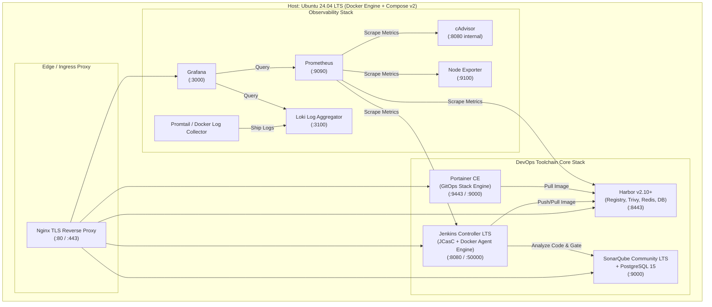

# Implementation Plan: Design & Generation for Real-World Deployment of Enterprise DevOps Platform

## 1. Executive Summary & Context

The **Enterprise DevOps Blueprint** repository contains the complete organizational policies, architecture documentation (`docs/`), ADRs (`adr/`), runbooks (`runbooks/`), SOPs (`sop/`), and application CI/CD templates (`templates/`). 

To transition this blueprint from architectural standards to an **actionable, operational, production-ready system** ("นำไปใช้ในการนำเอาไปใช้งานและสร้างระบบ เพื่อใช้งานจริง"), we must generate the **Platform Infrastructure as Code (IaC)**, **Automated Bootstrap & Provisioning Tooling**, **Platform Stacks**, **GitOps Manifests**, and **Verification Drills**.

This implementation plan defines the complete design and generation strategy to build the actual DevOps platform infrastructure on Ubuntu 24 LTS / Docker Engine / Portainer, satisfying all governance rules established in `AGENTS.md`.

---

## 2. AGENTS.md Policy Compliance Summary

In accordance with Section 2 of `AGENTS.md`:
- **Repository Mission**: Jenkins (CI/CD), SonarQube (Quality), Trivy (Security), Harbor (Registry), Docker/Compose (Runtime), Portainer (Visibility/GitOps), Prometheus/Grafana/Loki (Observability).
- **Security & Least Privilege**: No hardcoded production credentials, default deny firewall policies, isolated container networks, non-root container users, live-restore, and live log rotation limits.
- **GitOps Pull-based Standard**: Pull-based deployment via Portainer GitOps stacks (ADR-0010) referencing immutable image tags.
- **Verification Rule**: No claims of compliance or readiness without concrete, executable verification checks.

---

## 3. Proposed Target Architecture for Production Execution

### Platform Topology (Toolchain & Observability)



---

## 4. Proposed Generation Components

We propose generating a cohesive, modular, and production-grade implementation structure under `infra/` and `scripts/`:

```text
enterprise-devops-blueprint/
├── infra/
│   ├── .env.example                               # Production/Staging baseline environment variables
│   ├── README.md                                  # Platform deployment guide & operations
│   ├── docker-compose.platform.yml                # Core toolchain: Jenkins, SonarQube, Portainer
│   ├── docker-compose.observability.yml           # Observability: Prometheus, Grafana, Loki, cAdvisor, Node Exporter
│   ├── docker-compose.proxy.yml                   # TLS Gateway / Reverse Proxy (Nginx)
│   ├── configs/
│   │   ├── nginx/
│   │   │   ├── nginx.conf                         # High-performance, secure reverse proxy configuration
│   │   │   └── conf.d/platform.conf               # Upstream routing for harbor, jenkins, sonar, portainer, grafana
│   │   ├── jenkins/
│   │   │   ├── Dockerfile                         # Jenkins image with JCasC, Docker CLI, Trivy CLI preinstalled
│   │   │   ├── plugins.txt                        # Pinned Jenkins LTS plugins
│   │   │   └── jenkins.yaml                       # Jenkins Configuration as Code (JCasC) definition
│   │   ├── sonarqube/
│   │   │   └── sonar.properties.example           # SonarQube server optimization & db tuning
│   │   ├── prometheus/
│   │   │   ├── prometheus.yml                     # Scrape configs for host, containers, Jenkins, and apps
│   │   │   └── alerts.yml                         # Critical infrastructure & alert rules
│   │   ├── grafana/
│   │   │   ├── provisioning/
│   │   │   │   ├── datasources/datasources.yml    # Auto-connect Prometheus & Loki
│   │   │   │   └── dashboards/dashboards.yml      # Auto-load DevOps Platform dashboards
│   │   └── loki/
│   │       ├── loki-config.yml                    # Loki storage & retention policy
│   │       └── promtail-config.yml                # Promtail container log scraping
│   └── gitops-workloads/                          # Reference GitOps repo for Portainer deployment
│       ├── dev/
│       │   └── orders-stack.yml                   # DEV Portainer stack referencing Harbor images
│       ├── uat/
│       │   └── orders-stack.yml                   # UAT Portainer stack
│       └── prod/
│           └── orders-stack.yml                   # PROD Portainer stack with resource quotas & rollback
└── scripts/
    ├── setup-host.sh                              # Ubuntu 24.04 Host setup (Docker, sysctl, limits, UFW)
    ├── generate-certs.sh                          # TLS SAN certificates generation script (CA + wildcard/SAN)
    ├── bootstrap-platform.sh                      # Orchestrates end-to-end platform startup in sequence
    └── verify-platform.sh                         # Healthcheck & smoke-test verification drill
```

---

## 5. Detailed Component Breakdown

### Component 1: Host Preparation (`scripts/setup-host.sh`)
- Enforces OS pre-requisites for Ubuntu 24.04 LTS.
- Configures kernel parameters in `/etc/sysctl.d/99-devops-platform.conf`:
  - `vm.max_map_count=524288` (mandatory for SonarQube Elasticsearch).
  - `fs.file-max=131072`, `fs.inotify.max_user_watches=524288`.
- Installs Docker Engine and Docker Compose v2 plugin from official Docker APT repo.
- Deploys `/etc/docker/daemon.json` with live-restore, 10MB/3-file log limits, and non-conflicting default-address-pools (`10.200.0.0/16`).
- Pre-creates volume directories with correct UID/GID ownership:
  - Jenkins (`uid 1000:gid 1000`)
  - SonarQube (`uid 1000:gid 1000`)
  - Grafana (`uid 472:gid 472`)
  - Prometheus (`uid 65534:gid 65534`)
- Configures local host UFW firewall rules matching `docs/03-network/firewall-and-port-matrix.md`.

### Component 2: Core Platform Stack (`infra/docker-compose.platform.yml`)
- **Jenkins Controller**: Built with pinned plugins (`git`, `workflow-aggregator`, `configuration-as-code`, `sonar`, `docker-workflow`). Configured via JCasC (`jenkins.yaml`) for zero-click setup.
- **SonarQube LTS**: Pinned version with dedicated PostgreSQL 15 container, healthcheck endpoints, and volume persistence.
- **Portainer CE**: Portainer Server v2.20+ with volume persistence and GitOps Stack capabilities.
- **Harbor Integration Guide / Compose**: Instructions and compose integration to either run Harbor via official installer or via containerized compose profile.

### Component 3: Observability Stack (`infra/docker-compose.observability.yml`)
- **Prometheus**: Scrapes Node Exporter, cAdvisor, Jenkins `/prometheus`, and application targets.
- **Grafana**: Auto-provisioned with Prometheus & Loki datasources; includes pre-configured DevOps platform dashboard.
- **Loki & Promtail**: Centralized log collection for all Docker containers, parsing JSON log streams.
- **cAdvisor & Node Exporter**: Real-time container resource metrics (CPU, Memory, IO, Network) and host metrics.

### Component 4: TLS Reverse Proxy & Gateway (`infra/docker-compose.proxy.yml`)
- Nginx reverse proxy routing requests by hostname:
  - `harbor.<domain>` -> Harbor
  - `jenkins.<domain>` -> Jenkins (:8080)
  - `sonarqube.<domain>` -> SonarQube (:9000)
  - `portainer.<domain>` -> Portainer (:9443)
  - `grafana.<domain>` -> Grafana (:3000)
- Enforces TLS 1.2/1.3, secure headers (HSTS, X-Content-Type-Options, X-Frame-Options), and client upload limits (for large artifacts/images).

### Component 5: Automation & Health Verification Scripts
- `scripts/generate-certs.sh`: Creates root CA and SAN certificates for local/internal domains (`*.devops.local` or company domain).
- `scripts/bootstrap-platform.sh`: Single command to validate prerequisites, create networks, start services in dependency order (Proxy -> DBs -> Sonar -> Jenkins -> Portainer -> Observability), and wait for readiness.
- `scripts/verify-platform.sh`: Tests every service URL, checks database connectivity, validates Prometheus targets, and runs an end-to-end smoke test.

### Component 6: GitOps Application Workload Stacks (`infra/gitops-workloads/`)
- Reference Portainer stack manifests for `dev`, `uat`, and `prod` environments representing the real-world deployment repository model (ADR-0010).

---

## 6. User Review Required

> [!IMPORTANT]
> **Domain Name & Network Addressing**:
> The default configuration will use `*.devops.local` (e.g. `jenkins.devops.local`, `harbor.devops.local`) with self-signed SAN certificates for demonstration and local testing. In actual enterprise environments, this should be set in `.env` to match the company's internal DNS (e.g., `*.devops.internal.corp`).

> [!NOTE]
> **Hardware Requirements**:
> Running the full platform stack (Jenkins, SonarQube, Harbor, Observability, Portainer) on a single test/evaluation VM requires at minimum **4 vCPUs and 16GB RAM** (as documented in [server-sizing-guideline.md](file:///c:/Users/supachai.nil/Documents/GitHub/enterprise-devops-blueprint/docs/02-infrastructure/server-sizing-guideline.md)). The stacks can also be started independently.

---

## 7. Verification Plan

### Automated Checks:
1. Syntax validation of all YAML files (`docker-compose.platform.yml`, `docker-compose.observability.yml`, `prometheus.yml`, `jenkins.yaml`).
2. Shell script syntax verification using bash `-n`.
3. Validation of relative file references across the repository.

### Manual / Operational Verification (in `scripts/verify-platform.sh`):
1. Verify Docker Engine settings (`live-restore`, `default-address-pools`).
2. Verify kernel settings (`vm.max_map_count >= 262144`).
3. Verify HTTP/HTTPS healthcheck endpoints for Jenkins (`/login`), SonarQube (`/api/system/status`), Portainer (`/api/status`), Grafana (`/api/health`), Prometheus (`/-/healthy`), Loki (`/ready`).
4. Output execution summary and verification report.
